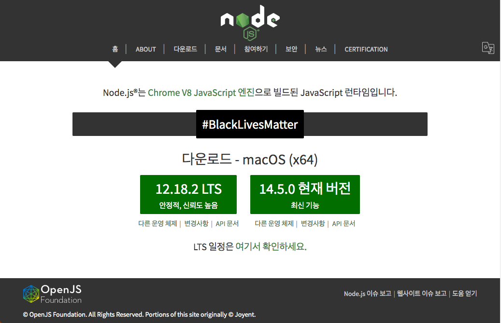
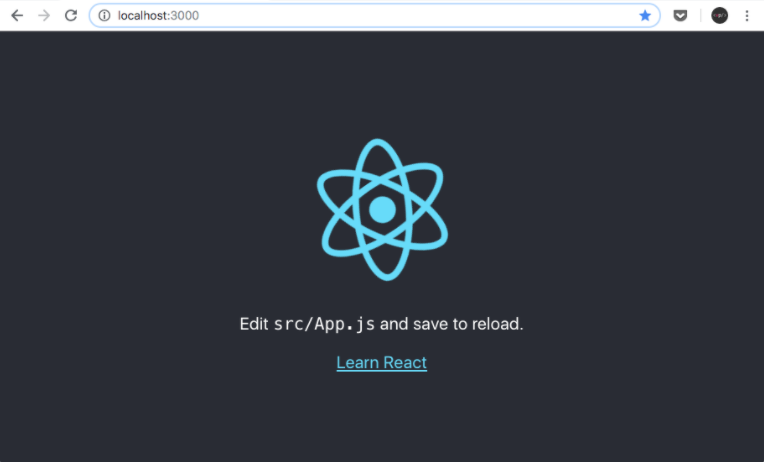
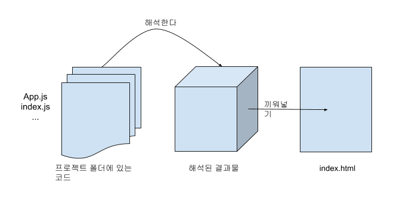
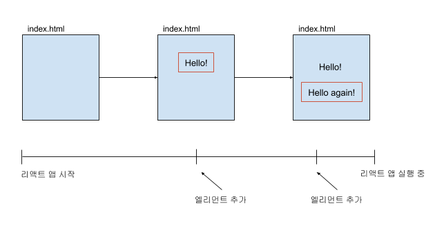
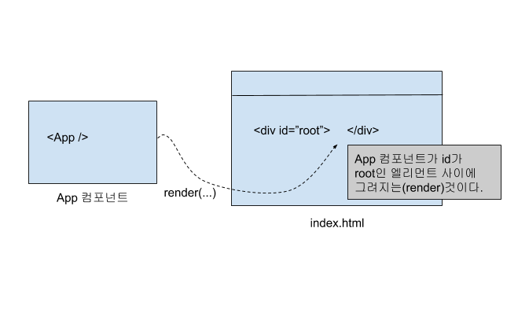
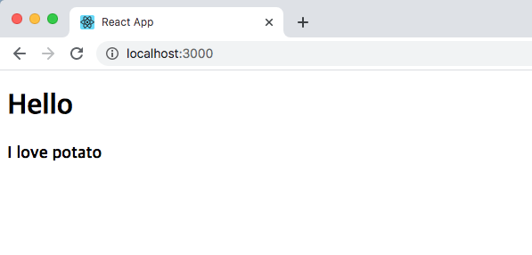
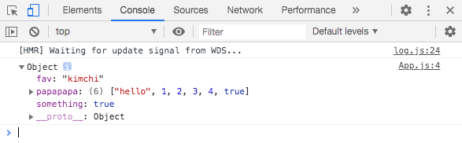
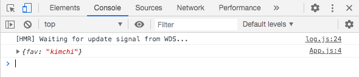
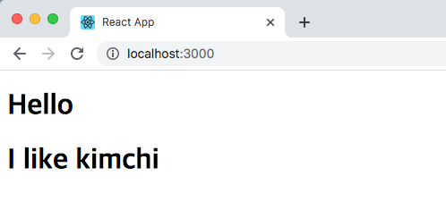
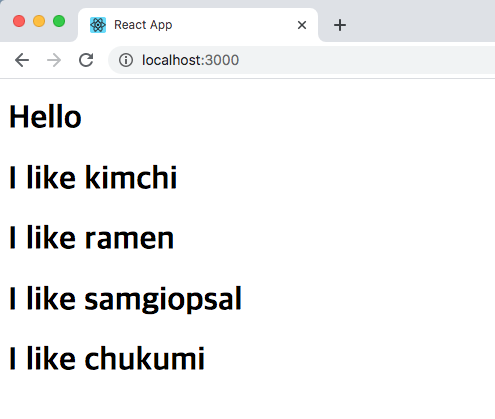

# Movie App 2020

Mobile-X 2020 하계 세미나 클론 코딩 영화 평점 웹서비스

---

## 목차

- [Ch01 - 안녕 리액트?](#ch01)
- [Ch02 - 리액트로 클론 코딩 시작하기](#ch02)
- [Ch03 - 리액트 기초 개념 알아보기](#ch03)

---

<a id="ch01"></a>
## Ch01 - 안녕 리액트?

1. [Node.js](https://velopert.com/133)

    **Node.js**는 Java 언어가 모든 OS 운영체제에서 Virtual Machine 환경 안에서 Runtime이 구동 되듯이 Node.js는 웹브라우저에 종속적인 자바스크립트에서 외부에서 실행할 수 있는 Runtime 환경을 **Chrome V8 엔진**을 제공하여 여러 OS 환경에서 실행할 수 있는 환경을 제공한다.

    Node.js가 효율적으로 사용되는 분야
    
    - 입출력이 잦은 어플리케이션
    - 데이터 스트리밍 어플리케이션
    - 데이터를 실시간으로 다루는 어플리케이션
    - JSON API 기반 어플리케이션
    - [싱글페이지](https://ko.wikipedia.org/wiki/%EC%8B%B1%EA%B8%80_%ED%8E%98%EC%9D%B4%EC%A7%80_%EC%95%A0%ED%94%8C%EB%A6%AC%EC%BC%80%EC%9D%B4%EC%85%98) 어플리케이션

    [**Node.js 설치하기**](https://nodejs.org/ko/)

    ```
    > node -v
    v12.16.1
    ```

    

1. [NPM](https://ko.wikipedia.org/wiki/Npm_(%EC%86%8C%ED%94%84%ED%8A%B8%EC%9B%A8%EC%96%B4))

    **npm** (노드 패키지 매니저/Node Package Manager)은 자바스크립트 프로그래밍 언어를 위한 패키지 관리자이다. 자바스크립트 런타임 환경 Node.js의 기본 패키지 관리자이다. 명령 줄 클라이언트(npm), 그리고 공개 패키지와 지블 방식의 개인 패키지의 **온라인 데이터베이스**(npm 레지스트리)로 이루어져 있다. 이 레지스트리는 클라이언트를 통해 접근되며 사용 가능한 패키지들은 npm 웹사이트를 통해 찾아보고 검색할 수 있다. 패키지 관리자와 레지스트리는 npm사에 의해 관리된다.

    패키지 매니저의 예시

    - Python : pip
    - Java : jpm
    - Javascript : npm

    **npm은 node.js를 설치하면 자동으로 설치된다.**

    ```
    > npm -v
    v6.13.4
    ```

    

1. [NPX](https://geonlee.tistory.com/32)

    npx는 자바스크립트 패키지 관리 모듈인 npm(Node Package Module)의 npm@5.2.0 버전부터 새로 추가된 도구입니다. 따라서 npm@5.2.0 이상 버전만 깔려 있다면 npx 커맨드를 사용 가능합니다.

    npx는 npm 레지스트리의 패키지 사용 경험을 파악하기 위한 도구입니다 - npm은 레지스트리에서 호스팅되는 종속성을 매우 쉽게 설치하고 관리할 수 있으며, npx는 레지스트리에서 호스팅되는 CLI 도구 및 기타 실행 파일을 쉽게 사용할 수 있습니다. 지금까지 일반적인 npm과 관련하여 약간의 귀찮은 과정들이 필요했던 여러 가지 사항을 크게 단순화합니다.

    **npx 설치하기**

    ```
    > npm intall npx -g
    생략...
    + npx@10.2.2
    added 293 packages from 654 contributors in 11.548s
    > npm -v
    6.13.4
    ```

---

<a id="ch02"></a>

## Ch02 - 리액트로 클론 코딩 시작하기

1. create-react-app으로 리액트 앱 만들기

    facebook에서 관리하는 React Boilerplate code 설치하기 

    > 보일러 플레이트(boilerplate)란 개발을 바로 시작할 수 있도록 만든 기초 환경을 말한다.

    ```
    >npx create-react-app movie_app_2020
    Success! Created movie_app_2020 at C:\movie_app_2020
    Inside that directory, you can run several commands:

        npm start
            Starts the development server.
    (생략...)
    ```

    npx는 create-react-app을 다운로드한 다음 create-react-app movie_app_2020 명령어를 실행하여 리액트 앱을 생성해 준다.

1. 리액트 앱 실행하기

    ```
    > npm start
    Compiled successfully!

    You can now view movie_app_2020 in the browser.

        Local:              http://localhost:3000
        On Your Network:    http://192.168.0.192:3000
    
    (생략...)
    ```

    

1. 리액트 동작 원리 알아보기

    리액트는 우리가 작성한(또는 수정한) 프로젝트 폴더에 있는 코드를 자바스크립트를 이용하여 해석한다. 그리고 해석한 결과물을 index.html로 끼워 넣는다. 그림으로 표현하면 아래와 같다.

    

    리액트는 index.html의 `<div id="root"></div>` 중간에 넣을 결과물을 프로젝트 폴더에 있는 파일(App.js,...)을 해석하여 만들어 넣는 역할을 담당한다.

1. index.js 살펴보기

    index.js폴더를 열어서 아래와 같이 표시된 부분을 살펴보자.

    ```js
    ReactDOM.render(<App />, document.getElementById('root'));
    ```
    
    이 코드가 바로 App.js 파일에 작성한 코드를 index.html의 아이디가 'root'인 엘리먼트에 넣어 주는 것이다.

1. index.html 수정해 보기

    index.html 파일을 열어서 `<div id="root"></div>`을 `<div id="potato"></div>`로 바꿔 보자.

    ```html
    (생략...)
        <body>
            <noscript>You need to enable JavaScript to run this app.</noscript>
            <div id="potato"></div>
            (생략...)
        </body>
    </html>
    ```

    이렇게 하면 아이디가 "potato"로 바뀌니까 앱이 실행되지 않는것을 볼 수 있다.

    > `<App />`을 아이디가 'root'인 엘리먼트에 그려지는데 아이디가 'root'에서 'potato'로 바뀌었으므로 오류가 발생한 것이다.

1. index.js 수정하여 오류 해결하기

    index.html에서 수정한 코드에 맞춰 index.js 파일의 document.getElementById('root')를 document.getElementById('potato')로 수정해 보자.

    ```js
    ReactDOM.render(<App />, document.getElementById('potato'));
    ```

    그러면 리액트 앱이 정상으로 작동한다. 리액트는 index.js에 있는 ReactDOM.render()를 통해 App.js에 있는 `<div>와</div>사이`에 있는 내용을 index.html에 넣어준다. 이 방식은 리액트가 화면을 빠르게 그릴 수 있게 해 주는 장점도 있다.

    

    그림을 통해 설명하자면, 가장 왼쪽은 빈 index.html이고 오른쪽은 App.js를 해석하며 점점 채워지는 index.html이다. 그림에서 보듯 리액트는 처음부터 모든 HTML을 그려넣지 않는다. 일부 HTML만 그리고 이후 엘리먼트를 추가하거나 제거하는 방식으로 화면을 그린다. 리액트는 화면에 표시된 모든 HTML을 처음부터 그리지 않기 때문에 빠르다.

<a id="ch03"></a>

## Ch03 - 리액트 기초 개념 알아보기

1. Add.js 파일로 컴포넌트의 정의 알아보기

    App.js 파일을 열고 App()함수와 App()함수가 반환하는 값 살펴보기

    ```js
    import React from 'react';

    function App() {
        return (
            <div>
                <h1>Hello<h1>
            </div>
        );
    }

    export default App;
    ```

    App()함수가 정의되어 있고, 이 함수가 `<div><h1>hello</h1></div>`를 반환하고 있다. 이것이 App 컴포넌트를 정의한 것이다. App() 함수가 반환한 HTML이 리액트 앱 화면에 그려지는 것이라고 할 수 있다.
    이 과정을 자세히 알아보자.

1. index.js 파일로 컴포넌트의 사용 알아보기

    index.js파일을 열고, `<App />`이라고 입력한 내용에 집중해 보자.

    ```js
    import React from 'react';
    import ReactDOM from 'react-dom';
    import App from './App';

    ReactDOM.render(<App />, document.getElementById('root'));
    ```

    App 컴포넌트 생김새가 마치 HTML 태그 같지만, HTML에는 저런 태그가 없다. `<App />`을 ReactDOM.render() 함수의 첫 번째 인자로 전달하면 App 컴포넌트가 반환하는 것들을 화면에 그릴 수 있다. App 컴포넌트가 그려질 위치는 ReactDOM.render()함수의 두 번째 인자로 전달하면 된다. 함수를 그대로 해석하면, **'App 컴포넌트는 아이디가 root인 엘리먼트에 그려질 것이다'** 라고 볼 수 있다.

    

    리액트는 `<App />`과 같은 표시를 컴포넌트로 인식하고, 그 컴포넌트가 반환하는 값을 화면에 그려준다.
    
    > 따라서 컴포넌트를 사용할 때 `<App />`가 아니라 App이라고 입력하면 오류가 발생한다.

1. [리액트 기초 개념 : JSX](https://ko.reactjs.org/docs/introducing-jsx.html)

    (1) 컴포넌트는 자바스크립트와 HTML을 조합한 JSX라는 문법을 사용해서 만든다. 하지만 JSX는 HTML이랑 자바스크립트를 조합한 것이기 때문에 새로운 문법은 아니다.

    컴포넌트를 만들다 보면 자연스럽게 JSX 문법을 어떻게 사용해야 하는지 알게 될 것이다. 감자(Potato)라는 이름의 컴포넌트를 JSX로 만들어 보자.

    (2) Potato 컴포넌트 만들기

    src 폴더안에 Potato.js라는 이름의 새 파일을 만들어 보자. 파일 이름에서 첫 번째 글자는 반드시 대문자로 하고, 파일을 열고 맨 위에 `import React from 'react';`를 입력한다.

    (3) 다음과 같이 Potato()함수를 작성해 보자.

    ```js
    import React from 'react';
    function Potato() {

    }
    ```

    이렇게 되면 Potato 컴포넌트의 기본 틀이 완성된 것이다. 컴포넌트를 작성할 때 **중요한 규칙은 이름은 대문자로 시작해야 한다**는 점이다. 

    (4) 다음을 참고하여 Potato가 JSX를 반환하도록 만들자.

    ```js
    import React from 'react';

    function Potato() {
        return <h3>I love potato<h3>;
    }
    ```
    
    > 아직 자바스크립트를 조합하지 않았을 뿐, Potato()함수는 JSX를 반환하고 있다.(HTML이 아님)

    (5) 마지막줄에 export default Potato;를 추가

    ```js
    import React from 'react';

    function Potato() {
        return <h3>I love potato<h3>;
    }

    export default Potato;
    ```

    export default Potato;를 추가하면 다른 파일에서 Potato 컴포넌트를 사용할 수 있다. 이것으로 Potato 컴포넌트를 완성했다.

    (6) Potato 컴포넌트 사용하기

    index.js 파일에서 App 컴포넌트가 사용된 부분에 Potato 컴포넌트를 추가하면 될 것 같지만, 리액트는 최종으로 단 한개의 컴포넌트를 그려야 하는데 두 개의 컴포넌트를 그리려 해서 오류가 발생할 것이다. Potato 컴포넌트는 App 컴포넌트 안에 넣어야 한다.

    (7) App 컴포넌트에 Potato 컴포넌트 임포트하기

    다음과 같이 수정하면 App 컴포넌트에 Potato 컴포넌트를 임포트 할 수 있다.

    ```js
    import React from 'react';
    import Potato from './Potato';
    
    ...(생략)
    ```

    > ./는 현재 파일이 있는 폴더를 의미하고 ../는 현재 파일이 있는 상위 폴더를 의미한다.

    App 컴포넌트가 반환할 값으로 `<Potato />` 를 추가해 보자.

    ```js
    import React from 'react';
    import Potato from './Potato';

    function App() {
        return (
            <div>
                <h1>Hello</h1>
                <Potato />
            </div>
        );
    }

    export defualt App;
    ```

    App 컴포넌트에 JSX로 작성한 `<div><h1>Hello</h1></div>`와 `<Potato />`에서 작성한 내용이 출력된 것을 확인할 수 있다.

    

    크롬 개발자 도구를 이용하여 Potato 컴포넌트를 살펴보면, 리액트가 `<Potato />`를 해석해서 `<h3>I love potato</h3>`로 만든것을 알 수 있다. 이것이 컴포넌트와 JSX가 리액트에서 동작하는 방식이다.

    Potato.js 파일을 삭제하고 App.js에서 작성했던 import Potato from './Potato';를 삭제해보자.

    이 상태에서 실행시키면 'App.js 파일에 Potato라는 것이 정의되지 않아서 컴파일에 실패했다'는 내용의 오류메시지가 나타난다. 이 오류를 해결하기 위해 App.js 파일 안에 Potato 컴포넌트를 만든 다음 Potato 컴포넌트를 사용해 보자.

    (8) App 컴포넌트 안에 Potato 컴포넌트 만들기

    App.js 파일에 Potato() 함수를 만들어 보자.

    ```js
    import React from 'react';

    function Potato() {
        return <h1>I like potato</h1>;
    }

    ...(생략)

    ```

    이 파일을 저장하면 리액트 앱이 다시 정상으로 작동한다. 여러개의 파일을 만들어 App.js에 임포트 해주는 방법도 있지만, 짧은 코드로 작성할 수 있는 컴포넌트는 App 컴포넌트 안에 작성하는 것이 여러 파일을 이동하며 코드 작업을 하는 것 보다 편리하다고 생각한다.

1. [리액트 기초 개념 : props](https://react.vlpt.us/basic/05-props.html)

    props는 간단히 말하자면 컴포넌트에서 컴포넌트로 전달하는 데이터를 말한다. 매개변수를 이용하면 함수를 효율적으로 재사용할 수 있는 개념과 비슷하다. props를 사용하면 컴포넌트로 효율적으로 재사용할 수 있다.

    [함수의 매개변수가 무엇인지 궁금하다면](https://ko.javascript.info/function-basics#ref-531)

    (1) 컴포넌트 여러 개 사용해 보기
    
    이 전에 작성하였던 App.js 파일을 수정하여 `<Potato />`를 여러 개 사용해 보자.

    ```js
    import React from 'react';

    function Potato() {
        return <h1>I like potato</h1>;
    }

    function App() {
        return (
            <div>
                <h1>Hello</h1>
                <Potato />
                <Potato />
                <Potato />
                <Potato />
                <Potato />
                <Potato />
                <Potato />
                <Potato />
            </div>
        );
    }

    export default App;
    ```

    앱을 실행하면 i like potato가 8개 출력된 것을 볼 수 있다. 하지만 비효율적이다. Potato 컴포넌트 8개를 손으로 직접 입력하고, 8개의 값이 모두 i like potato로 같다. 컴포넌트가 서로 다른 값을 출력해야 영화 앱을 만들 때 영화 목록을 구현할 수 있을 것이다. 그래서 컴포넌트로 데이터를 보내는 방법이 바로 **props** 이다.

    (2) props로 컴포넌트에 데이터 전달하기

    아직 영화 데이터를 다루지 않으니 잠시 음식을 주제로 리액트 앱을 만들어 보자.

    컴포넌트의 이름을 Potato에서 Food로 변경하고 Potato 컴포넌트는 모두 삭제한다.

    `<Food />`를 `<Food fav="kimchi" />`로 수정해 보자. fav props의 값으로 "kimchi"를 추가하는 것이다.

    ```js
    import React from 'react';

    function Food() {
        return <h1>I like potato</h1>;
    }

    function App() {
        return (
            <div>
                <h1>Hello</h1>
                <Food fav="kimchi" />
            </div>
        );
    }

    export default App;
    ```

    > fav는 favorite의 줄임말이다.

    이게 바로 props를 이용하여 Food 컴포넌트에 데이터를 보내는 방법이다. Food 컴포넌트에 사용한 props의 이름은 fav이고, fav에 "kimchi"라는 값을 담아 Food 컴포넌트에 보낸 것이다.

    props에는 불리언 값(true, false), 숫자, 배열과 같은 다양한 형태의 데이터를 담을 수 있다. **여기서 주의할 점은 'props에 있는 데이터는 문자열인 경우를 제외하면 모두 중괄호({})로 값을 감싸야 한다는 점'이다.**

    (3) Food 컴포넌트에 props 전달하기

    다음과 같이 Food 컴포넌트에 something, papapapa props를 추가해 보고 수정된 파일을 저장해 보자.

    ```
    (생략...)
    
        <Food fav="kimchi" something={true} papapapa={['hello', 1, 2, 3, 4, true]} />
    
    (생략...)
    ```

    리액트 앱을 실행해 보자.

    

    그러면 아무런 변화가 없을 것이다. Food 컴포넌트에 props를 보내기만 했을 뿐 아직 사용하지 않았기 때문이다. 

    (4) props 사용하기

    Food 컴포넌트의 인자로 전달된 props 출력해보기

    ```js
    import React from 'react';

    function Food(props) {
        console.log(props);
        return <h1>I like potato</h1>;
    }

    function App() {
        return (
            <div>
                <h1>Hello</h1>
                 <Food fav="kimchi" something={true} papapapa={['hello', 1, 2, 3, 4, true]} />
            </div>
        );
    }

    export default App;
    ```

    > Food() 함수의 첫 번째 인자에는 props가 넘어온다.

    리액트 앱 화면은 여전히 아무런 변화가 없을 것이다. console.log() 함수는 개발자 도구의 [Console] 탭에만 영향을 주는 함수이기 때문이다.

    개발자 도구를 실행해서 [Console] 탭을 눌러 보자

    

    Food 컴포넌트에 전달한 props(fav, something, papapapa)를 속성으로 가지는 객체(Object)가 출력되었다.

    (5) props 다시 한 번 사용하기

    코드를 다음과 같이 수정해보자. something, papapapa props는 사용하지 않을 것이기 때문에 지우자.

    ```js
    import React from 'react';

    function Food(props) {
        console.log(props);
        return <h1>I like potato</h1>;
    }

    function App() {
        return (
            <div>
                <h1>Hello</h1>
                 <Food fav="kimchi" />
            </div>
        );
    }
    
    export default App;
    ```

    그러면 콘솔에 {fav: "kimchi"}만 출력될 것이다.

    

    만약 문자열 "kimchi"를 화면 그대로 출력하고 싶다면 props.fav를 중괄호로 감싸서 사용하면 된다.

    ```js
    import React from 'react';

    function Food(props) {
        return <h1>I like {props.fav}</h1>;
    }

    function App() {
        return (
            <div>
                <h1>Hello</h1>
                 <Food fav="kimchi">
            </div>
        );
    }

    export default App;
    ```

    

    > Hello는 App 컴포넌트에서 바로 출력한 것이고, I like kimchi는 Food 컴포넌트에서 props를 이용하여 출력한 것이다.

    객체에 있는 값을 사용하려면 점 연산자(.)를 써야 한다. fav props의 값을 사용하려면 props.fav와 같이 점 연산자를 사용해야 한다. 

    [점 연산자가 궁금하다면](https://developer.mozilla.org/ko/docs/Web/JavaScript/Reference/Operators/Property_Accessors)


    (6) 구조 분해 할당으로 props 사용하기

    [자바스크립트 ES6의 문법](https://itstory.tk/entry/JavaScript-ES6-%EB%AC%B8%EB%B2%95-%EC%A0%95%EB%A6%AC) 중 [구조 분해 할당(desturcturing-assignment)](https://www.zerocho.com/category/ECMAScript/post/575d20a97d96d81700508ccd)을 사용하면 점 연산자를 사용하지 않아도 된다.

    ```js
    function Food(props) {
        {fav} = props;
        return <h1>I like {fav}</h1>;
    }
    ----------------------------------
    function Food({fav}) {
        return <h1>I like {fav}</h1>;
    }
    ```

    > 두 방법 중 아무거나 사용해도 된다.

    props에 포함된 데이터의 개수가 적으면 점 연산자를 사용하여 props.fav와 같은 방법으로 사용해도 불편하지 않지만, props에 포함된 데이터의 개수가 많아지면 매번 props.fav와 같은 방법으로 사용하면 불편하다. 이런 경우 구조 분해 할당을 사용하면 편리하다.

    (7) 여러 개의 컴포넌트에 props 사용하기

    Food 컴포넌트를 3개 추가하고 fav props의 값이 서로 다르도록 코드를 수정하자.

    ```js
    import React from 'react';

    function Food({fav}) {
        return <h1>I like {fav}</h1>;
    }

    function App() {
        return (
            <div>
                <h1>Hello</h1>
                 <Food fav="kimchi" />
                 <Food fav="ramen" />
                 <Food fav="samgiopsal" />
                 <Food fav="chukumi" />
            </div>
        );
    }

    export default App;
    ```

    

    이번에는 Food 컴포넌트를 4개 사용해 각 컴포넌트에 전달한 fav props를 출력했다. 각각의 fav props에는 서로 다른 값이 들어 있으니까 같은 컴포넌트를 사용해도 서로 다른 문장이 출력된 것이다. 이것을 컴포넌트를 재사용한다고 하는 것이다.

    **Ch03에서 배운 내용들**

    1. 컴포넌트가 무엇인지 알아보고 JSX를 공부했다.
    1. JSX는 단지 HTML과 자바스크립트를 조합한 문법이고
    1. JSX를 이용해서 컴포넌트를 작성했다. 컴포넌트의 이름은 대문자로 시작해야 하고
    1. 컴포넌트에 데이터를 전달할 때는 props를 사용하면 된다. 컴포넌트에 props를 전달하면 props에 있는 데이터가 하나의 객체로 변환되어 컴포넌트(함수)의 인자로 전달되고, 이걸 받아서 컴포넌트(함수)에서 사용할 수 있었다. ES6의 구조 분해 할당을 사용하면 props를 좀 더 편리한 방법으로 사용할 수 있었다.


