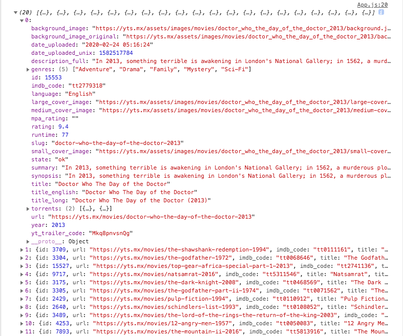
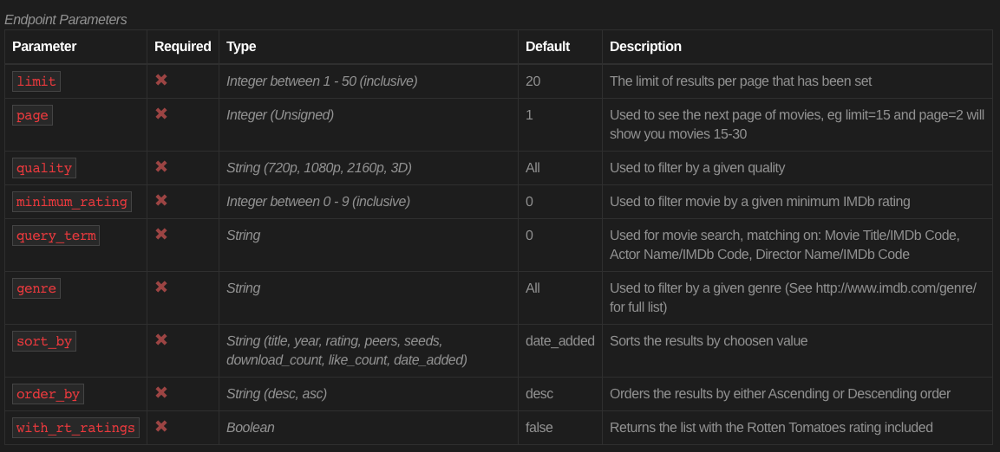
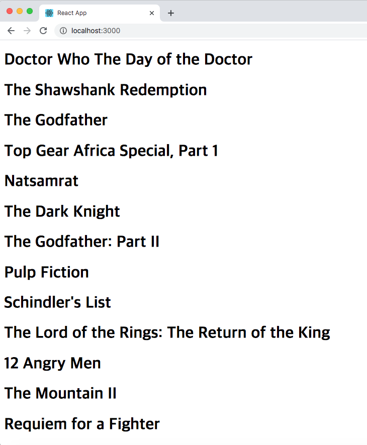
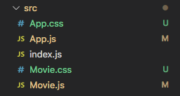
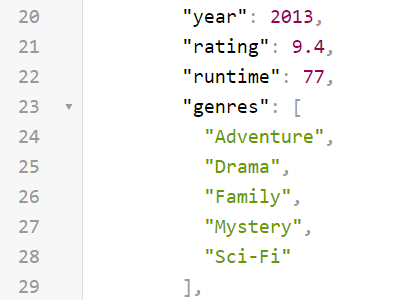
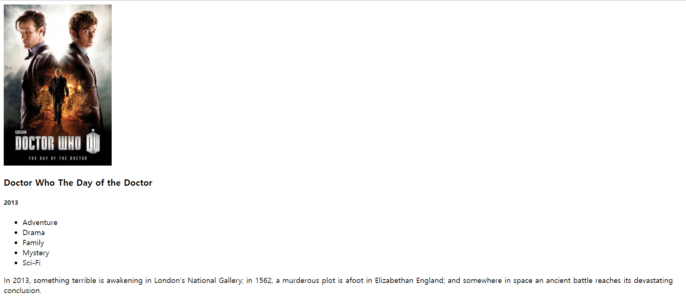
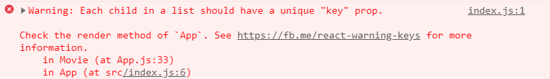
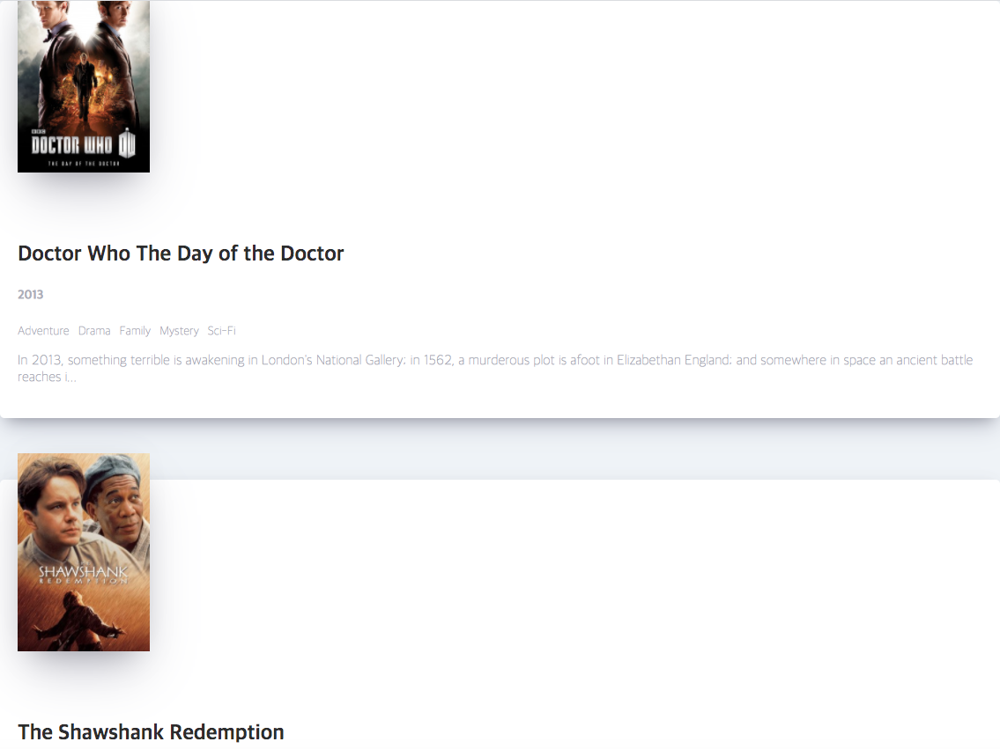
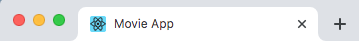
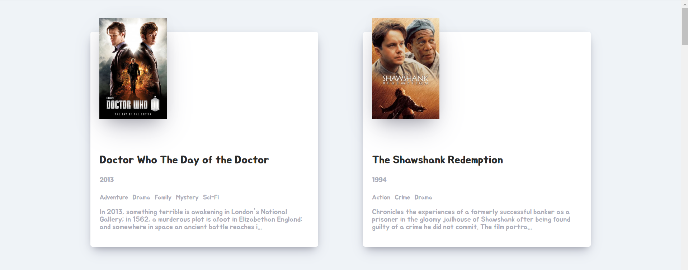

# Movie App 2020

Mobile-X 2020 하계 세미나 클론 코딩 영화 평점 웹서비스

교재 : Do it! 클론 코딩 영화 평점 웹서비스

---

## 목차

- [Ch01 - 안녕 리액트?](#ch01)
- [Ch02 - 리액트로 클론 코딩 시작하기](#ch02)
- [Ch03 - 리액트 기초 개념 알아보기](#ch03)
- [Ch04 - 슈퍼 똑똑하게 컴포넌트 만들기](#ch04)
- [Ch05 - state와 클래스형 컴포넌트](#ch05)
- [Ch06 - 영화 앱 만들기](#ch06)
- [Ch07 - 영화 앱 다듬기](#ch07)
- [Ch08 - 영화 앱에 여러 기능 추가하기](#ch08)

---

<a id="ch01"></a>
## Ch01 - 안녕 리액트?

1. [Node.js](https://velopert.com/133)

    **Node.js**는 Java 언어가 모든 OS 운영체제에서 Virtual Machine 환경 안에서 Runtime이 구동 되듯이 Node.js는 웹브라우저에 종속적인 자바스크립트에서 외부에서 실행할 수 있는 Runtime 환경을 **Chrome V8 엔진**을 제공하여 여러 OS 환경에서 실행할 수 있는 환경을 제공한다.

    Node.js가 효율적으로 사용되는 분야
    
    - 입출력이 잦은 어플리케이션
    - 데이터 스트리밍 어플리케이션
    - 데이터를 실시간으로 다루는 어플리케이션
    - JSON API 기반 어플리케이션
    - [싱글페이지](https://ko.wikipedia.org/wiki/%EC%8B%B1%EA%B8%80_%ED%8E%98%EC%9D%B4%EC%A7%80_%EC%95%A0%ED%94%8C%EB%A6%AC%EC%BC%80%EC%9D%B4%EC%85%98) 어플리케이션

    [**Node.js 설치하기**](https://nodejs.org/ko/)

    ```
    > node -v
    v12.16.1
    ```

    

1. [NPM](https://ko.wikipedia.org/wiki/Npm_(%EC%86%8C%ED%94%84%ED%8A%B8%EC%9B%A8%EC%96%B4))

    **npm** (노드 패키지 매니저/Node Package Manager)은 자바스크립트 프로그래밍 언어를 위한 패키지 관리자이다. 자바스크립트 런타임 환경 Node.js의 기본 패키지 관리자이다. 명령 줄 클라이언트(npm), 그리고 공개 패키지와 지블 방식의 개인 패키지의 **온라인 데이터베이스**(npm 레지스트리)로 이루어져 있다. 이 레지스트리는 클라이언트를 통해 접근되며 사용 가능한 패키지들은 npm 웹사이트를 통해 찾아보고 검색할 수 있다. 패키지 관리자와 레지스트리는 npm사에 의해 관리된다.

    패키지 매니저의 예시

    - Python : pip
    - Java : jpm
    - Javascript : npm

    **npm은 node.js를 설치하면 자동으로 설치된다.**

    ```
    > npm -v
    v6.13.4
    ```

    

1. [NPX](https://geonlee.tistory.com/32)

    npx는 자바스크립트 패키지 관리 모듈인 npm(Node Package Module)의 npm@5.2.0 버전부터 새로 추가된 도구입니다. 따라서 npm@5.2.0 이상 버전만 깔려 있다면 npx 커맨드를 사용 가능합니다.

    npx는 npm 레지스트리의 패키지 사용 경험을 파악하기 위한 도구입니다 - npm은 레지스트리에서 호스팅되는 종속성을 매우 쉽게 설치하고 관리할 수 있으며, npx는 레지스트리에서 호스팅되는 CLI 도구 및 기타 실행 파일을 쉽게 사용할 수 있습니다. 지금까지 일반적인 npm과 관련하여 약간의 귀찮은 과정들이 필요했던 여러 가지 사항을 크게 단순화합니다.

    **npx 설치하기**

    ```
    > npm intall npx -g
    생략...
    + npx@10.2.2
    added 293 packages from 654 contributors in 11.548s
    > npm -v
    6.13.4
    ```

---

<a id="ch02"></a>

## Ch02 - 리액트로 클론 코딩 시작하기

1. create-react-app으로 리액트 앱 만들기

    facebook에서 관리하는 React Boilerplate code 설치하기 

    > 보일러 플레이트(boilerplate)란 개발을 바로 시작할 수 있도록 만든 기초 환경을 말한다.

    ```
    >npx create-react-app movie_app_2020
    Success! Created movie_app_2020 at C:\movie_app_2020
    Inside that directory, you can run several commands:

        npm start
            Starts the development server.
    (생략...)
    ```

    npx는 create-react-app을 다운로드한 다음 create-react-app movie_app_2020 명령어를 실행하여 리액트 앱을 생성해 준다.

1. 리액트 앱 실행하기

    ```
    > npm start
    Compiled successfully!

    You can now view movie_app_2020 in the browser.

        Local:              http://localhost:3000
        On Your Network:    http://192.168.0.192:3000
    
    (생략...)
    ```

    

1. 리액트 동작 원리 알아보기

    리액트는 우리가 작성한(또는 수정한) 프로젝트 폴더에 있는 코드를 자바스크립트를 이용하여 해석한다. 그리고 해석한 결과물을 index.html로 끼워 넣는다. 그림으로 표현하면 아래와 같다.

    

    리액트는 index.html의 `<div id="root"></div>` 중간에 넣을 결과물을 프로젝트 폴더에 있는 파일(App.js,...)을 해석하여 만들어 넣는 역할을 담당한다.

1. index.js 살펴보기

    index.js폴더를 열어서 아래와 같이 표시된 부분을 살펴보자.

    ```js
    ReactDOM.render(<App />, document.getElementById('root'));
    ```
    
    이 코드가 바로 App.js 파일에 작성한 코드를 index.html의 아이디가 'root'인 엘리먼트에 넣어 주는 것이다.

1. index.html 수정해 보기

    index.html 파일을 열어서 `<div id="root"></div>`을 `<div id="potato"></div>`로 바꿔 보자.

    ```html
    (생략...)
        <body>
            <noscript>You need to enable JavaScript to run this app.</noscript>
            <div id="potato"></div>
            (생략...)
        </body>
    </html>
    ```

    이렇게 하면 아이디가 "potato"로 바뀌니까 앱이 실행되지 않는것을 볼 수 있다.

    > `<App />`을 아이디가 'root'인 엘리먼트에 그려지는데 아이디가 'root'에서 'potato'로 바뀌었으므로 오류가 발생한 것이다.

1. index.js 수정하여 오류 해결하기

    index.html에서 수정한 코드에 맞춰 index.js 파일의 document.getElementById('root')를 document.getElementById('potato')로 수정해 보자.

    ```js
    ReactDOM.render(<App />, document.getElementById('potato'));
    ```

    그러면 리액트 앱이 정상으로 작동한다. 리액트는 index.js에 있는 ReactDOM.render()를 통해 App.js에 있는 `<div>와</div>사이`에 있는 내용을 index.html에 넣어준다. 이 방식은 리액트가 화면을 빠르게 그릴 수 있게 해 주는 장점도 있다.

    

    그림을 통해 설명하자면, 가장 왼쪽은 빈 index.html이고 오른쪽은 App.js를 해석하며 점점 채워지는 index.html이다. 그림에서 보듯 리액트는 처음부터 모든 HTML을 그려넣지 않는다. 일부 HTML만 그리고 이후 엘리먼트를 추가하거나 제거하는 방식으로 화면을 그린다. 리액트는 화면에 표시된 모든 HTML을 처음부터 그리지 않기 때문에 빠르다.

<a id="ch03"></a>

## Ch03 - 리액트 기초 개념 알아보기

1. Add.js 파일로 컴포넌트의 정의 알아보기

    App.js 파일을 열고 App()함수와 App()함수가 반환하는 값 살펴보기

    ```js
    import React from 'react';

    function App() {
        return (
            <div>
                <h1>Hello<h1>
            </div>
        );
    }

    export default App;
    ```

    App()함수가 정의되어 있고, 이 함수가 `<div><h1>hello</h1></div>`를 반환하고 있다. 이것이 App 컴포넌트를 정의한 것이다. App() 함수가 반환한 HTML이 리액트 앱 화면에 그려지는 것이라고 할 수 있다.
    이 과정을 자세히 알아보자.

1. index.js 파일로 컴포넌트의 사용 알아보기

    index.js파일을 열고, `<App />`이라고 입력한 내용에 집중해 보자.

    ```js
    import React from 'react';
    import ReactDOM from 'react-dom';
    import App from './App';

    ReactDOM.render(<App />, document.getElementById('root'));
    ```

    App 컴포넌트 생김새가 마치 HTML 태그 같지만, HTML에는 저런 태그가 없다. `<App />`을 ReactDOM.render() 함수의 첫 번째 인자로 전달하면 App 컴포넌트가 반환하는 것들을 화면에 그릴 수 있다. App 컴포넌트가 그려질 위치는 ReactDOM.render()함수의 두 번째 인자로 전달하면 된다. 함수를 그대로 해석하면, **'App 컴포넌트는 아이디가 root인 엘리먼트에 그려질 것이다'** 라고 볼 수 있다.

    

    리액트는 `<App />`과 같은 표시를 컴포넌트로 인식하고, 그 컴포넌트가 반환하는 값을 화면에 그려준다.
    
    > 따라서 컴포넌트를 사용할 때 `<App />`가 아니라 App이라고 입력하면 오류가 발생한다.

1. [리액트 기초 개념 : JSX](https://ko.reactjs.org/docs/introducing-jsx.html)

    (1) 컴포넌트는 자바스크립트와 HTML을 조합한 JSX라는 문법을 사용해서 만든다. 하지만 JSX는 HTML이랑 자바스크립트를 조합한 것이기 때문에 새로운 문법은 아니다.

    컴포넌트를 만들다 보면 자연스럽게 JSX 문법을 어떻게 사용해야 하는지 알게 될 것이다. 감자(Potato)라는 이름의 컴포넌트를 JSX로 만들어 보자.

    (2) Potato 컴포넌트 만들기

    src 폴더안에 Potato.js라는 이름의 새 파일을 만들어 보자. 파일 이름에서 첫 번째 글자는 반드시 대문자로 하고, 파일을 열고 맨 위에 `import React from 'react';`를 입력한다.

    (3) 다음과 같이 Potato()함수를 작성해 보자.

    ```js
    import React from 'react';
    function Potato() {

    }
    ```

    이렇게 되면 Potato 컴포넌트의 기본 틀이 완성된 것이다. 컴포넌트를 작성할 때 **중요한 규칙은 이름은 대문자로 시작해야 한다**는 점이다. 

    (4) 다음을 참고하여 Potato가 JSX를 반환하도록 만들자.

    ```js
    import React from 'react';

    function Potato() {
        return <h3>I love potato<h3>;
    }
    ```
    
    > 아직 자바스크립트를 조합하지 않았을 뿐, Potato()함수는 JSX를 반환하고 있다.(HTML이 아님)

    (5) 마지막줄에 export default Potato;를 추가

    ```js
    import React from 'react';

    function Potato() {
        return <h3>I love potato<h3>;
    }

    export default Potato;
    ```

    export default Potato;를 추가하면 다른 파일에서 Potato 컴포넌트를 사용할 수 있다. 이것으로 Potato 컴포넌트를 완성했다.

    (6) Potato 컴포넌트 사용하기

    index.js 파일에서 App 컴포넌트가 사용된 부분에 Potato 컴포넌트를 추가하면 될 것 같지만, 리액트는 최종으로 단 한개의 컴포넌트를 그려야 하는데 두 개의 컴포넌트를 그리려 해서 오류가 발생할 것이다. Potato 컴포넌트는 App 컴포넌트 안에 넣어야 한다.

    (7) App 컴포넌트에 Potato 컴포넌트 임포트하기

    다음과 같이 수정하면 App 컴포넌트에 Potato 컴포넌트를 임포트 할 수 있다.

    ```js
    import React from 'react';
    import Potato from './Potato';
    
    ...(생략)
    ```

    > ./는 현재 파일이 있는 폴더를 의미하고 ../는 현재 파일이 있는 상위 폴더를 의미한다.

    App 컴포넌트가 반환할 값으로 `<Potato />` 를 추가해 보자.

    ```js
    import React from 'react';
    import Potato from './Potato';

    function App() {
        return (
            <div>
                <h1>Hello</h1>
                <Potato />
            </div>
        );
    }

    export defualt App;
    ```

    App 컴포넌트에 JSX로 작성한 `<div><h1>Hello</h1></div>`와 `<Potato />`에서 작성한 내용이 출력된 것을 확인할 수 있다.

    

    크롬 개발자 도구를 이용하여 Potato 컴포넌트를 살펴보면, 리액트가 `<Potato />`를 해석해서 `<h3>I love potato</h3>`로 만든것을 알 수 있다. 이것이 컴포넌트와 JSX가 리액트에서 동작하는 방식이다.

    Potato.js 파일을 삭제하고 App.js에서 작성했던 import Potato from './Potato';를 삭제해보자.

    이 상태에서 실행시키면 'App.js 파일에 Potato라는 것이 정의되지 않아서 컴파일에 실패했다'는 내용의 오류메시지가 나타난다. 이 오류를 해결하기 위해 App.js 파일 안에 Potato 컴포넌트를 만든 다음 Potato 컴포넌트를 사용해 보자.

    (8) App 컴포넌트 안에 Potato 컴포넌트 만들기

    App.js 파일에 Potato() 함수를 만들어 보자.

    ```js
    import React from 'react';

    function Potato() {
        return <h1>I like potato</h1>;
    }

    ...(생략)

    ```

    이 파일을 저장하면 리액트 앱이 다시 정상으로 작동한다. 여러개의 파일을 만들어 App.js에 임포트 해주는 방법도 있지만, 짧은 코드로 작성할 수 있는 컴포넌트는 App 컴포넌트 안에 작성하는 것이 여러 파일을 이동하며 코드 작업을 하는 것 보다 편리하다고 생각한다.

1. [리액트 기초 개념 : props](https://react.vlpt.us/basic/05-props.html)

    props는 간단히 말하자면 컴포넌트에서 컴포넌트로 전달하는 데이터를 말한다. 매개변수를 이용하면 함수를 효율적으로 재사용할 수 있는 개념과 비슷하다. props를 사용하면 컴포넌트로 효율적으로 재사용할 수 있다.

    [함수의 매개변수가 무엇인지 궁금하다면](https://ko.javascript.info/function-basics#ref-531)

    (1) 컴포넌트 여러 개 사용해 보기
    
    이 전에 작성하였던 App.js 파일을 수정하여 `<Potato />`를 여러 개 사용해 보자.

    ```js
    import React from 'react';

    function Potato() {
        return <h1>I like potato</h1>;
    }

    function App() {
        return (
            <div>
                <h1>Hello</h1>
                <Potato />
                <Potato />
                <Potato />
                <Potato />
                <Potato />
                <Potato />
                <Potato />
                <Potato />
            </div>
        );
    }

    export default App;
    ```

    앱을 실행하면 i like potato가 8개 출력된 것을 볼 수 있다. 하지만 비효율적이다. Potato 컴포넌트 8개를 손으로 직접 입력하고, 8개의 값이 모두 i like potato로 같다. 컴포넌트가 서로 다른 값을 출력해야 영화 앱을 만들 때 영화 목록을 구현할 수 있을 것이다. 그래서 컴포넌트로 데이터를 보내는 방법이 바로 **props** 이다.

    (2) props로 컴포넌트에 데이터 전달하기

    아직 영화 데이터를 다루지 않으니 잠시 음식을 주제로 리액트 앱을 만들어 보자.

    컴포넌트의 이름을 Potato에서 Food로 변경하고 Potato 컴포넌트는 모두 삭제한다.

    `<Food />`를 `<Food fav="kimchi" />`로 수정해 보자. fav props의 값으로 "kimchi"를 추가하는 것이다.

    ```js
    import React from 'react';

    function Food() {
        return <h1>I like potato</h1>;
    }

    function App() {
        return (
            <div>
                <h1>Hello</h1>
                <Food fav="kimchi" />
            </div>
        );
    }

    export default App;
    ```

    > fav는 favorite의 줄임말이다.

    이게 바로 props를 이용하여 Food 컴포넌트에 데이터를 보내는 방법이다. Food 컴포넌트에 사용한 props의 이름은 fav이고, fav에 "kimchi"라는 값을 담아 Food 컴포넌트에 보낸 것이다.

    props에는 불리언 값(true, false), 숫자, 배열과 같은 다양한 형태의 데이터를 담을 수 있다. **여기서 주의할 점은 'props에 있는 데이터는 문자열인 경우를 제외하면 모두 중괄호({})로 값을 감싸야 한다는 점'이다.**

    (3) Food 컴포넌트에 props 전달하기

    다음과 같이 Food 컴포넌트에 something, papapapa props를 추가해 보고 수정된 파일을 저장해 보자.

    ```
    (생략...)
    
        <Food fav="kimchi" something={true} papapapa={['hello', 1, 2, 3, 4, true]} />
    
    (생략...)
    ```

    리액트 앱을 실행해 보자.

    

    그러면 아무런 변화가 없을 것이다. Food 컴포넌트에 props를 보내기만 했을 뿐 아직 사용하지 않았기 때문이다. 

    (4) props 사용하기

    Food 컴포넌트의 인자로 전달된 props 출력해보기

    ```js
    import React from 'react';

    function Food(props) {
        console.log(props);
        return <h1>I like potato</h1>;
    }

    function App() {
        return (
            <div>
                <h1>Hello</h1>
                 <Food fav="kimchi" something={true} papapapa={['hello', 1, 2, 3, 4, true]} />
            </div>
        );
    }

    export default App;
    ```

    > Food() 함수의 첫 번째 인자에는 props가 넘어온다.

    리액트 앱 화면은 여전히 아무런 변화가 없을 것이다. console.log() 함수는 개발자 도구의 [Console] 탭에만 영향을 주는 함수이기 때문이다.

    개발자 도구를 실행해서 [Console] 탭을 눌러 보자

    

    Food 컴포넌트에 전달한 props(fav, something, papapapa)를 속성으로 가지는 객체(Object)가 출력되었다.

    (5) props 다시 한 번 사용하기

    코드를 다음과 같이 수정해보자. something, papapapa props는 사용하지 않을 것이기 때문에 지우자.

    ```js
    import React from 'react';

    function Food(props) {
        console.log(props);
        return <h1>I like potato</h1>;
    }

    function App() {
        return (
            <div>
                <h1>Hello</h1>
                 <Food fav="kimchi" />
            </div>
        );
    }
    
    export default App;
    ```

    그러면 콘솔에 {fav: "kimchi"}만 출력될 것이다.

    

    만약 문자열 "kimchi"를 화면 그대로 출력하고 싶다면 props.fav를 중괄호로 감싸서 사용하면 된다.

    ```js
    import React from 'react';

    function Food(props) {
        return <h1>I like {props.fav}</h1>;
    }

    function App() {
        return (
            <div>
                <h1>Hello</h1>
                 <Food fav="kimchi">
            </div>
        );
    }

    export default App;
    ```

    

    > Hello는 App 컴포넌트에서 바로 출력한 것이고, I like kimchi는 Food 컴포넌트에서 props를 이용하여 출력한 것이다.

    객체에 있는 값을 사용하려면 점 연산자(.)를 써야 한다. fav props의 값을 사용하려면 props.fav와 같이 점 연산자를 사용해야 한다. 

    [점 연산자가 궁금하다면](https://developer.mozilla.org/ko/docs/Web/JavaScript/Reference/Operators/Property_Accessors)


    (6) 구조 분해 할당으로 props 사용하기

    [자바스크립트 ES6의 문법](https://itstory.tk/entry/JavaScript-ES6-%EB%AC%B8%EB%B2%95-%EC%A0%95%EB%A6%AC) 중 [구조 분해 할당(desturcturing-assignment)](https://www.zerocho.com/category/ECMAScript/post/575d20a97d96d81700508ccd)을 사용하면 점 연산자를 사용하지 않아도 된다.

    ```js
    function Food(props) {
        {fav} = props;
        return <h1>I like {fav}</h1>;
    }
    ----------------------------------
    function Food({fav}) {
        return <h1>I like {fav}</h1>;
    }
    ```

    > 두 방법 중 아무거나 사용해도 된다.

    props에 포함된 데이터의 개수가 적으면 점 연산자를 사용하여 props.fav와 같은 방법으로 사용해도 불편하지 않지만, props에 포함된 데이터의 개수가 많아지면 매번 props.fav와 같은 방법으로 사용하면 불편하다. 이런 경우 구조 분해 할당을 사용하면 편리하다.

    (7) 여러 개의 컴포넌트에 props 사용하기

    Food 컴포넌트를 3개 추가하고 fav props의 값이 서로 다르도록 코드를 수정하자.

    ```js
    import React from 'react';

    function Food({fav}) {
        return <h1>I like {fav}</h1>;
    }

    function App() {
        return (
            <div>
                <h1>Hello</h1>
                 <Food fav="kimchi" />
                 <Food fav="ramen" />
                 <Food fav="samgiopsal" />
                 <Food fav="chukumi" />
            </div>
        );
    }

    export default App;
    ```

    

    이번에는 Food 컴포넌트를 4개 사용해 각 컴포넌트에 전달한 fav props를 출력했다. 각각의 fav props에는 서로 다른 값이 들어 있으니까 같은 컴포넌트를 사용해도 서로 다른 문장이 출력된 것이다. 이것을 컴포넌트를 재사용한다고 하는 것이다.

    **Ch03에서 배운 내용들**

    1. 컴포넌트가 무엇인지 알아보고 JSX를 공부했다.
    1. JSX는 단지 HTML과 자바스크립트를 조합한 문법이고
    1. JSX를 이용해서 컴포넌트를 작성했다. 컴포넌트의 이름은 대문자로 시작해야 하고
    1. 컴포넌트에 데이터를 전달할 때는 props를 사용하면 된다. 컴포넌트에 props를 전달하면 props에 있는 데이터가 하나의 객체로 변환되어 컴포넌트(함수)의 인자로 전달되고, 이걸 받아서 컴포넌트(함수)에서 사용할 수 있었다. ES6의 구조 분해 할당을 사용하면 props를 좀 더 편리한 방법으로 사용할 수 있었다.

<a id="ch04"></a>
## Ch04 - 슈퍼 똑똑하게 컴포넌트 만들기

이전에 작성한 App.js 파일을 열어 코드가 효율적인지 확인해보자. 새 음식을 추가할 때마다 `<Food fav="..." />`를 복사해야 하기 때문이 이 코드는 효율적이지 않다. 만약 음식이 1000개라면 1000개를 반복해서 작성해야 하고, fav props에 다른 값을 입력해 줘야 한다. 또 서버에서 음식 데이터를 받아 출력하는 경우, 음식 데이터의 개수를 알 수 없다면 이 방법은 문제가 될 수 있다. 이 문제를 해결하는 방법에 대해 알아보자.

1. 음식 데이터 만들기

    서버에서 넘어온 데이터를 저장할 수 있도록 FoodILike라는 변수를 만든 다음 빈 배열을 할당하자.

    ```js
    import React from 'react';

    function Food({ fav }) {
        return <h1>I like {fav}</h1>;
    }

    const foodILike = [];

    function App() {
        return (
            <div>
                <h1>Hello</h1>
            </div>
        );
    }

    export default App;
    ```

    서버에서 데이터가 넘어온다고 상상하면서 다음과 같이 코드를 작성해 보자. image 키값의 경우 인터넷에서 찾은 이미지의 주소를 복사하여 붙여 넣은 것이다.

    ```js
    import React from 'react';

    function Food({fav}) {
    return <h1>I like {fav}</h1>;
    }

    const foodILike = [
    {
        name: 'Kimchi',
        image: 'https://www.bgw.kr/wp-content/uploads/2019/12/%EC%88%98%EC%9E%85%EA%B9%80%EC%B9%98.png',
    },
    {
        name: 'Samgyeopsal',
        image: 'https://i.pinimg.com/originals/c4/c5/d5/c4c5d5d428634b5ddf1aabd9f98faf60.jpg',
    },
    {
        name: 'Bibimbap',
        image: 'https://img.etoday.co.kr/pto_db/2019/07/600/20190726153503_1350707_1200_876.jpg',
    },
    {
        name: 'Doncasu',
        image: 'https://post-phinf.pstatic.net/MjAyMDA0MTZfMjY3/MDAxNTg2OTk5MzYwOTMw.YZk3XJCkJqOrZmSzXTGfnXcfoj5CoLQfY9kEBhBmlyYg.WdEgjt1SmPLlCfi8nmVMB79FymTDi3ApEfQJrGF57Acg.JPEG/1.jpg?type=w1200',
    },
    {
        name: 'Kimbap',
        image: 'https://www.nongsaro.go.kr/ps/img/interabang/num207/headerImg.jpg',
    },
    ];

    function App() {
    return (
        <div>
        <h1>Hello</h1>
        </div>
    );
    }

    export default App;
    ```

    이제 foodILike에 있는 데이터를 이용하여 여러 개의 컴포넌트를 만들어 보자.

1. [map() 함수](https://velog.io/@daybreak/Javascript-map%ED%95%A8%EC%88%98)로 컴포넌트 많이 만들기

    map() 함수에 대한 간단한 설명

    

    여기서 map() 함수의 2가지 특징을 알 수 있다.

    **첫 번째**는 map() 함수의 인자로 전달한 함수는 배열 friends의 원소를 대상으로 실행된다는 것이다. friends에는 4개의 원소가 들어 있으니까 함수는 4번 실행된다. **두 번째**는 그 함수가 반환한 값이 모여 배열이 되고, 그 배열이 map() 함수의 반환값이 된다는 것이다.
    
    이 특징을 이용하여 current 인자에 하트를 추가하여 반환해 보자.

    

    여기서는 화살표 함수가 아니라 이름 없는 함수를 전달했다. 이름 없는 함수의 friend에는 friends 배열의 원소가 하나씩 넘어오고, 그 원소에 하트를 붙여 반환하니까 사진과 같은 결과를 얻을 수 있다.

    이제 map() 함수를 foodILike 배열에 적용하여 코드를 작성해 보자.    

     ```js
    import React from 'react';

    function Food({ name }) {
    return <h1>I like {name}</h1>;
    }

    const foodILike = [
    {
        name: 'Kimchi',
        image: 'https://www.bgw.kr/wp-content/uploads/2019/12/%EC%88%98%EC%9E%85%EA%B9%80%EC%B9%98.png',
    },
    {
        name: 'Samgyeopsal',
        image: 'https://i.pinimg.com/originals/c4/c5/d5/c4c5d5d428634b5ddf1aabd9f98faf60.jpg',
    },
    {
        name: 'Bibimbap',
        image: 'https://img.etoday.co.kr/pto_db/2019/07/600/20190726153503_1350707_1200_876.jpg',
    },
    {
        name: 'Doncasu',
        image: 'https://post-phinf.pstatic.net/MjAyMDA0MTZfMjY3/MDAxNTg2OTk5MzYwOTMw.YZk3XJCkJqOrZmSzXTGfnXcfoj5CoLQfY9kEBhBmlyYg.WdEgjt1SmPLlCfi8nmVMB79FymTDi3ApEfQJrGF57Acg.JPEG/1.jpg?type=w1200',
    },
    {
        name: 'Kimbap',
        image: 'https://www.nongsaro.go.kr/ps/img/interabang/num207/headerImg.jpg',
    },
    ];

    function App() {
    return (
        <div>
            {foodILike.map(dish => (<Food name={dish.name} />))}
        </div>
    );
    }

    export default App;
    ```   

    

    여기서 가장 중요한 부분은 `{foodILike.map(dish =>(Food name={dish.name} />))}` 이다. dish에 foodILike 배열에 있는 원소가 하나씩 넘어가고, 그 원소는 {name:'...', image:'...'}와 같은 객체 형태이므로 Food 컴포넌트에 dish.name과 같이 음식 이름을 name props로 넘겨준 것이다. 결국 map() 함수는 `[<Food name={...} />,...]`와 같이 Food 컴포넌트 원소 5개를 가진 배열을 반환할 것이다. 그 결과 음식 이름 5개가 화면에 표시되는 것이다.

    Food 컴포넌트에 음식 이미지 출력하기

    Food 컴포넌트에 picture props를 추가하자. picture props에 dish.image를 전달할 것이다.

    ```js
    import React from 'react';

    function Food({ name, picture }) {
    return (
        <div>
            <h2>I like {name}</h2>
            
        </div>
    );
    }

    const foodILike = [
    {
        name: 'Kimchi',
        image: 'https://www.bgw.kr/wp-content/uploads/2019/12/%EC%88%98%EC%9E%85%EA%B9%80%EC%B9%98.png',
    },
    {
        name: 'Samgyeopsal',
        image: 'https://i.pinimg.com/originals/c4/c5/d5/c4c5d5d428634b5ddf1aabd9f98faf60.jpg',
    },
    {
        name: 'Bibimbap',
        image: 'https://img.etoday.co.kr/pto_db/2019/07/600/20190726153503_1350707_1200_876.jpg',
    },
    {
        name: 'Doncasu',
        image: 'https://post-phinf.pstatic.net/MjAyMDA0MTZfMjY3/MDAxNTg2OTk5MzYwOTMw.YZk3XJCkJqOrZmSzXTGfnXcfoj5CoLQfY9kEBhBmlyYg.WdEgjt1SmPLlCfi8nmVMB79FymTDi3ApEfQJrGF57Acg.JPEG/1.jpg?type=w1200',
    },
    {
        name: 'Kimbap',
        image: 'https://www.nongsaro.go.kr/ps/img/interabang/num207/headerImg.jpg',
    },
    ];

    function App() {
    return (
        <div>
        {foodILike.map(dish => (<Food name={dish.name} picture={dish.image} />))}
        </div>
    );
    }

    export default App;
    ```

    
    
    

    이렇게 map() 함수를 사용하면 배열에 데이터가 몇 개 있든지 컴포넌트를 여러 개 손쉽게 출력할 수 있다.

1. map() 함수로 만든 컴포넌트에 key props 추가하기

    [key props가 필요한 이유](https://www.awesomezero.com/development/react-key/)

    이전에 작성한 코드를 [Console] 탭의 경고 메시지를 한번 읽어보면, '리스트의 각 원소는 유일한 "key" prop을 가져야 한다'고 한다. 배열 속성을 보면 key의 값이 실제로 없어서(null) 이런 메시지가 나온 것이다. 리액트의 원소들은 유일해야 하는데 리액트 원소가 리스트에 포함되면서 유일성이 없어진 것이다.

    이 문제를 해결하기 위해 foodILike 배열 원소에 id라는 값을 추가하자.

    ```js
    (생략...)
    const foodILike = [
    {
        id: 1,
        name: 'Kimchi',
        image: 'https://www.bgw.kr/wp-content/uploads/2019/12/%EC%88%98%EC%9E%85%EA%B9%80%EC%B9%98.png',
    },
    {
        id: 2,
        name: 'Samgyeopsal',
        image: 'https://i.pinimg.com/originals/c4/c5/d5/c4c5d5d428634b5ddf1aabd9f98faf60.jpg',
    },
    {
        id: 3,
        name: 'Bibimbap',
        image: 'https://img.etoday.co.kr/pto_db/2019/07/600/20190726153503_1350707_1200_876.jpg',
    },
    {
        id: 4,
        name: 'Doncasu',
        image: 'https://post-phinf.pstatic.net/MjAyMDA0MTZfMjY3/MDAxNTg2OTk5MzYwOTMw.YZk3XJCkJqOrZmSzXTGfnXcfoj5CoLQfY9kEBhBmlyYg.WdEgjt1SmPLlCfi8nmVMB79FymTDi3ApEfQJrGF57Acg.JPEG/1.jpg?type=w1200',
    },
    {
        id: 5,
        name: 'Kimbap',
        image: 'https://www.nongsaro.go.kr/ps/img/interabang/num207/headerImg.jpg',
    },
    ];

    function App() {
    return (
        <div>
        {foodILike.map(dish => (<Food name={dish.name} picture={dish.image} />))}
        </div>
    );
    }

    export default App;
    ```

    리액트는 Food 컴포넌트가 서로 다르다는 것을 알 방법이 없기 때문에 데이터에 id를 추가한다. 그리고 리액트에게 컴포넌트가 서로 다르다는 것을 알려 주는 방법이 컴포넌트에 key props를 추가해 주는 것이다.

    Food 컴포넌트에 key props를 추가하자. key props의 값으로 {dish.id}를 전달하면 된다.

    ```js
    (생략...)
    function App() {
        return (
            <div>
                {foodILike.map(dish => (<Food key={dish.id} namd={dish.name} picture={dish.image} />))}
            </div>
        );
    }
    (생략...)
    ```

1. img 엘리먼트에 alt 속성 추가하기

    다음과 같이 Food 컴포넌트를 수정해 보자. alt 속성을 추가하고 거기에 {name}을 대입한 것이다. 그러면 메시지가 없어질 것이다.

    ```js
    (생략...)
    function Food({ name, picture }) {
        return (
            <div>
                <h2>I like {name}</h2>
                
            </div>
        );
    }
    (생략...)
    ```

1. 음식 데이터에 rating 추가하기

    foodILike 배열의 각 요소에 rating(평점)을 추가하자. 값의 자료형은 당연히 Number이다.

    > foodILike에 입력한 값이 데이터베이스에서 넘어온 값이라고 상상해 보자.

    ```js
    import React from 'react';

    function Food({ name, picture }) {
    return (
        <div>
            <h2>I like {name}</h2>
            
        </div>
    );
    }

    const foodILike = [
    {
        id: 1,
        name: 'Kimchi',
        image: 'https://www.bgw.kr/wp-content/uploads/2019/12/%EC%88%98%EC%9E%85%EA%B9%80%EC%B9%98.png',
        rating: 5,
    },
    {
        id: 2,
        name: 'Samgyeopsal',
        image: 'https://i.pinimg.com/originals/c4/c5/d5/c4c5d5d428634b5ddf1aabd9f98faf60.jpg',
        rating: 4.9,
    },
    {
        id: 3,
        name: 'Bibimbap',
        image: 'https://img.etoday.co.kr/pto_db/2019/07/600/20190726153503_1350707_1200_876.jpg',
        rating: 4.5,
    },
    {
        id: 4,
        name: 'Doncasu',
        image: 'https://post-phinf.pstatic.net/MjAyMDA0MTZfMjY3/MDAxNTg2OTk5MzYwOTMw.YZk3XJCkJqOrZmSzXTGfnXcfoj5CoLQfY9kEBhBmlyYg.WdEgjt1SmPLlCfi8nmVMB79FymTDi3ApEfQJrGF57Acg.JPEG/1.jpg?type=w1200',
        rating: 4.0,
    },
    {
        id: 5,
        name: 'Kimbap',
        image: 'https://www.nongsaro.go.kr/ps/img/interabang/num207/headerImg.jpg',
        rating: 3.5,
    },
    ];

    function App() {
    return (
        <div>
        {foodILike.map(dish => (<Food name={dish.name} picture={dish.image} />))}
        </div>
    );
    }

    export default App;
    ```

    rating이 포함된 음식 데이터가 준비되었다. 이제 rating props를 Food 컴포넌트에 전달하면서 이 값을 검사해 보자. 그러려면 props의 자료형을 검사할 수 있도록 만들어 주는 prop-types라는 도구를 설치해야 한다.

1. [prop-types](https://ko.reactjs.org/docs/typechecking-with-proptypes.html) 설치하기

    터미널에 명령을 입력해서 prop-types를 설치

    ```
    > npm install prop-types
    ```

    package.json 파일을 열어 dependencies 키에 있는 값을 살펴보자. 그 중에 prop-types가 있으면 설치가 잘 된것이다.

1. prop-types 적용하기

    import PropTypes from 'prop-types';를 Add.js 파일 맨 위에 추가헤 주자. 그리고 rating props를 Food 컴포넌트에 전달하자.

    ```js
    import React from 'react';
    import PropTypes from 'prop-types';

    function Food({ name, picture, rating }) {
    return (
        <div>
            <h2>I like {name}</h2>
            <h4>{rating}/5.0</h4>
            
        </div>
    );
    }

    const foodILike = [
    {
        id: 1,
        name: 'Kimchi',
        image: 'https://www.bgw.kr/wp-content/uploads/2019/12/%EC%88%98%EC%9E%85%EA%B9%80%EC%B9%98.png',
        rating: 5,
    },
    {
        id: 2,
        name: 'Samgyeopsal',
        image: 'https://i.pinimg.com/originals/c4/c5/d5/c4c5d5d428634b5ddf1aabd9f98faf60.jpg',
        rating: 4.9,
    },
    {
        id: 3,
        name: 'Bibimbap',
        image: 'https://img.etoday.co.kr/pto_db/2019/07/600/20190726153503_1350707_1200_876.jpg',
        rating: 4.5,
    },
    {
        id: 4,
        name: 'Doncasu',
        image: 'https://post-phinf.pstatic.net/MjAyMDA0MTZfMjY3/MDAxNTg2OTk5MzYwOTMw.YZk3XJCkJqOrZmSzXTGfnXcfoj5CoLQfY9kEBhBmlyYg.WdEgjt1SmPLlCfi8nmVMB79FymTDi3ApEfQJrGF57Acg.JPEG/1.jpg?type=w1200',
        rating: 4.0,
    },
    {
        id: 5,
        name: 'Kimbap',
        image: 'https://www.nongsaro.go.kr/ps/img/interabang/num207/headerImg.jpg',
        rating: 3.5,
    },
    ];

    function App() {
    return (
        <div>
        {foodILike.map(dish => (<Food name={dish.name} picture={dish.image} rating={dish.rating} />))}
        </div>
    );
    }

    export default App;
    ```
    
    

    아직 prop-types를 적용하진 않았지만 앱을 실행해 보면 rating props로 전달한 값이 잘 출력될 것이다.

    다음과 같이 Food.propType를 작성해 보자. 모든 props는 문자열이고 반드시 있어야 한다는 조건을 추가했다.

    ```js
    import React from 'react';
    import PropTypes from 'prop-types';

    function({ name, picture, rating}) { (생략...) }

    const foodILike = [ (생략...) ];

    function App() { (생략...) }

    Food.propTypes = {
        name: PropTypes.string.isRequired,
        picture: PropTypes.string.isRequired,
        rating: PropTypes.string.isRequired,
    };
    
    export default App;
    ```

    코드를 작성한 다음 저장하고 앱을 실행해 보면 별 문제가 없어 보인다. 하지만 [Console] 탭을 확인해 보면 경고 메시지가 있을 것이다. 앱을 실행하는 데는 문제가 없지만, 뭔가 검사가 진헹되었고 그에 따라 경고 메시지를 출력해 준것이다.

    

    'Food 컴포넌트의 rating props 자료형이 string 이어야 하는데, number 라서 문제다' 라고 이야기 하고 있다.

    `rating: PropTypes.string.isRequired,`를 보면 rating의 키값이 PropTypes.string.isRequired라고 되어 있다. string은 '문자열'을 뜻하고, isRequired는 '필요하다'라는 뜻이다. 이를 합치면 'rating에는 string이라는 자료형이 필요하다'는 뜻이 된다. 하지만 넘겨준 값의 자료형은 Number이기 때문에 경고 메시지가 나타난 것이다.

1. Prop-types 경고 해결하기

    다음과 같이 수정해 보자.

    ```
    rating: PropTypes.number.isRequired,
    ```
    
    그런 다음 [Console] 탭을 확인해 보면 경고 메시지는 사라져 있을 것이다.

1. isRequired 뜻 살펴보기

    rating의 .isRequired를 제거해 보자.

    ```
    rating: PropTypes.number,
    ```

    rating: PropTypes.number라고 작성하면, rating props는 필수가 아니어도 되는 항목이 된다. 다만, 값이 전달되는 경우 자료형이 number이긴 해야 한다.

<a id="ch05"></a>
## Ch05 - [state](https://ko.reactjs.org/docs/faq-state.html)와 클래스형 컴포넌트

1. state로 숫자 증감 기능 만들어 보기

    (1) 클래스형 컴포넌트 작성하기

    ```js
    import React from 'react';

    export default App;
    // 이 두 줄만 남기고 나머지 코드는 모두 삭제한다.
    ```

    다음과 같이 코드를 작성하자. 핵심은 App 클래스가 React.Component 클래스를 상속받도록 extends React.Component를 붙이는 것이다. 이것이 **클래스형 컴포넌트의 기본 뼈대**이다.

    ```js
    import React from 'react';

    class App extends React.Component {
        // App 클래스는 React.Component 클래스를 상속받았다.
    }

    export default App;
    ```

    > 상속은 '클래스에 다른 클래스의 기능을 추가할 수 있게' 해준다. 실제로 React.Component 클래스는 500줄이 넘는 코드로 여러 기능이 구현되어 있다.

    
    이제 App 컴포넌트가 JSX를 반환해야 한다. 그런데 지금의 App 컴포넌트는 클래스라서(함수가 아니라서) return 문을 사용할 수 없고, 함수 형태의 App 컴포넌트처럼 JSX를 반환할 수 없다. 클래스형 컴포넌트에서는 JSX를 반환하기 위해 render() 함수를 사용한다.

    다음과 같이 render() 함수를 작성해 보자.

    ```js
    import React from 'react';

    class App extends React.Component {
        render() {
            return <h1>I'm a class component</h1>;
        }
    }

    export default App;
    ```

    

    결과를 보면 함수형 컴포넌트를 사용했을 때와 별 차이가 없다. 하지만 **함수형 컴포넌트는 return 문이 JSX를 반환하지만, 클래스형 컴포넌트는 render() 함수가 JSX를 반환한다.** 그리고 리액트는 클래스형 컴포넌트의 render() 함수를 자동으로 실행시켜 준다. 클래스형 컴포넌트를 사용하는 이유는 **state를 사용하기 위함**이다.

    (2) state 정의하기

    ```js
    import React from 'react';

    class App extends React.Component {
        state = {
                    // 다음과 같이 state={};라고 작성하여 state를 정의한다.
        };
        render() {
            return <h1>I'm a class component</h1>;
        }
    }

    export default App;
    ```

    (3) state에 count값 추가하고 사용하기

     ```js
    import React from 'react';

    class App extends React.Component {
        state = {
            count : 0,  // 다음과 같이 state에 count라는 키를 추가하고 키값으로 0을 넣는다.
        };
        render() {  // render() 함수에 {this.state.count}를 출력
            return <h1>The number is: {this.state.count}</h1>;
        }
    }

    export default App;
    ```   

    

    > this.state는 현재 클래스에서 선언한 state를 의미한다. 그러므로 this.state.count는 현재 클래스에 선언한 state의 count 키값을 의미한다.

    (4) 버튼을 눌러서 count state값 변경해 보기

    ```js
    import React from 'react';

    class App extends React.Component {
    state = {
        count: 0,
    };

    add = () => {   // add()함수 작성
        this.state.count = 1;   // this.state.count 마음대로 바꿔보기
    };

    minus = () => { // minus() 함수 작성
        this.state.count = -1;  // this.state.count 마음대로 바꿔보기
    };

    render() {
        return (    // 버튼을 누르면 동작하도록 onClick 속성 추가
        <div>
            <h1>The number is: {this.state.count}</h1>
            <button onClick={this.add}>Add</button>
            <button onClick={this.minus}>Minus</button>
        </div>
        );
    }
    }

    export default App;
    ```   

    state는 말 그대로 그냥 객체니까 this.state.count = 1 또는 this.state.count = -1과 같이 값을 바꿀 수 있다고 생각할 수 있다. 그런데 코드를 작성하고 저장하면 [Console] 탭에 경고 메시지가 나타난다.

    

    경고 메시지의 내용은 'state를 직접 변경하지 마라'이다. 실제로 리액트는 state를 직접 변경하는 코드를 허용하지 않는다. 그래서 버튼을 눌러도 0이 1이나 -1로 변하지 않는다. **원래 리액트는 state가 변경되면 render() 함수를 다시 실행하여 변경된 state를 화면에 출력한다. 그런데 state를 직접 변경하는 경우에는 render() 함수를 다시 실행하지 않는다.** 리액트는 이런 방식으로 state를 직접 변경할 수 없도록 제한한다.

    (5) setState() 함수로 count state 변경하기

    ```js
    import React from 'react';

    class App extends React.Component {
    state = {
        count: 0,
    };

    add = () => {   // 다음과 같이 setState() 함수의 첫 번째 인자로 count 키와 키값을 넣은 객체를 전달해 보자.
        this.setState({ count: 1 });    
    };

    minus = () => { 
        this.setState({ count: -1 });
    };

    (생략...)
    ```      

    
    

    결과를 보니 count state가 1 또는 -1로 변하고 있다.

    리액트가 setState() 함수의 호출을 감시하고 있기 때문에 setState() 함수가 동작하면 state가 새로운 값으로 바뀌고, 이어서 render() 함수를 동작시켜 화면을 업데이트시키는 것이다.

    

    > setState() 함수에 새로운 객체를 전달하면 리액트가 자동으로 state에 반영해 준다.

    (6) 버튼을 누르면 count state의 값을 증가 또는 감소시키기

     ```js
    import React from 'react';

    class App extends React.Component {
    state = {
        count: 0,
    };

    add = () => {  // count state를 1만큼 증가
        this.setState({ count: this.state.count + 1 });    
    };

    minus = () => { // count state를 1만큼 감소
        this.setState({ count: this.state.count - 1 });
    };

    (생략...)
    ```     

    앱을 실행하면 잘 동작할 것이다. 다만 { count: this.state.count + 1 }와 같이 코드를 작성하여 state를 업데이트하는 방법은 성능 문제가 생길 수 있어서 좋지 않다. 그 대신 setState() 함수의 인자로 함수를 전달하면 성능 문제 없이 state를 업데이트 할 수 있다.

    다음과 같이 current 인자를 받아 객체 ({ count: current.count + 1 })를 반환하는 함수를 작성하여 setState() 함수에 전달해 보고 결과를 확인하면서 **add, minus() 함수를 개선**하자.

      ```js
    import React from 'react';

    class App extends React.Component {
    state = {
        count: 0,
    };

    add = () => {  // current에는 현재 state가 넘어와 그 state의 count에 1을 더해주는 것이다.
        this.setState(current => ({ count: current.count + 1 }));    
    };

    minus = () => { 
        this.setState(current => ({ count: current.count - 1 }));
    };

    (생략...)
    ```     

    state는 동적 데이터를 사용할 때 반드시 도입해야 할 요소다. 영화 앱에서 동적 데이터를 다룰 때 state를 자주 사용하니 잘 익혀두도록 하자!

1. 클래스형 컴포넌트의 일생 알아보기

    클래스형 컴포넌트에는 render() 함수 외에도 여러 함수가 있다. 그중에서도 클래스형 컴포넌트의 일생을 만들어 주는 생명주기 함수를 순서대로 알아보자. 생명주기 함수를 이용해서 영화 데이터를 가져와야 하니까 생명주기 함수를 알아야 한다. 

    (1) [constructor() 함수](https://velog.io/@bclef25/React-Lifecycle-2rk4p6wg38) 알아보기

    > constructor() 함수는 생명주기 함수는 아니지만 클래스형 컴포넌트가 생성될 때 호출되므로 설명한다.

    다음과 같이 코드를 작성해보자.

    ```js
    import React from 'react';

    class App extends React.Component {
        constructor(props) {
            super(props);
            console.log('hello');
        }
        (생략...)
        render() {
            console.log('render');
            return (
                <div>
                    <h1>The number is: {this.state.count}</h1>
                    <button onClick={this.add}>Add</button>
                    <button onClick={this.minus}>Minus</button>
                    </div>
            );
        }
    }

    export default App;
    ```

    [Console] 탭의 결과를 보면 constructor() 함수에 있는 console.log() 함수가 먼저 실행될 것이다. render() 함수보다 constructor() 함수가 먼저 실행된 것이다.

    

    > constructor() 함수는 render() 함수보다 먼저 실행되지만 React.Component에 포함된 함수가 아닌 자바스크립트 함수이다.

    (2) [componentDidMount() 함수](https://velog.io/@bclef25/React-Lifecycle-2rk4p6wg38) 알아보기

    componentDidMount() 함수를 작성한 다음, 그 안에 console.log() 함수를 작성하자. 함수를 작성하는 위치는 App 클래스 안이면 어디든 상관없다. 

    ```js
    (생략...)
        componentDidMount() {
            console.log('component rendered');
        }

    render() {
        console.log("I'm rendering");
        return (
            <div>
                <h1>The number is: {this.state.count}</h1>
                <button onClidk={this.add}>Add</button>
                <button onClick={this.minus}>Minus</button>
            </div>
        );
    }

    export default App;
    ```

    

    [Console] 탭을 보면 render() 함수가 실행된 다음 componentDidMount() 함수가 실행된 것을 알 수 있다. 여기까지 알아본 3가지 함수가 바로 리액트에서 마운트(Mount)로 분류하는 생명주기 함수이다. render() 함수, constructor() 함수, componentDidMount() 함수.

    

    (3) componentDidUpdate() 함수 알아보기

    componentDidUpdate() 함수를 작성한 다음, 그 안에 console.log()를 작성하자. 이 함수의 위치는 App 컴포넌트 안이라면 어디든 상관없다.

    ```js
    import React from 'react';

    class App extends React.component {
        (생략...)
        componentDidMount() {
            console.log('component rendered');
        }

        componentDidUpdate() {
            console.log('I just updated');
        }
        (생략...)
    ```

    함수 이름에서 짐작할 수 있듯이 이 함수는 화면이 업데이트되면(새로 그려지면) 실행된다. 앞에서 만든 숫자 증감 앱에서는 `<Add> 또는 <Minus>` 버튼을 눌러서 setState() 함수를 실행시키는 경우에 화면이 업데이트 된다. 그래서 `<Add> 또는 <Minus>`버튼을 누르면 I'm rendering 과 I just updated라는 문장이 [Console] 탭에 출력될 것이다. 확인해보자.

    

    

    `<Add> 또는 <Minus>` 버튼을 누르면 setState() 함수가 실행되고, render() 함수가 다시 실행되니까(화면이 업데이트되니까) componentDidUpdate() 함수가 실행되는 것이다.

    (4) componentWillUnmonut() 함수 알아보기

    componentWillUnmount() 함수를 작성한 다음, 그 안에 console.log()를 작성하자. 이 함수 역시 App 컴포넌트 안이면 어디에 작성해도 상관없다.

    ```js
    (생략...)
    componentDidMount() {
        console.log('component rendered');
    }

    componentDidUpdate() {
        console.log('I just updated');
    }

    componentWillUnmount() {
        console.log('Goodbye, cruel world');
    }
    (생략...)
    ```

    > componentWillUnmount() 함수는 보통 컴포넌트에 적용한 이벤트 리스너를 제거할 때 많이 사용한다.


    이 함수는 실행되지 않을 것이다. 왜냐하면 컴포넌트가 화면에서 떠나게 만드는 코드를 작성하지 않았기 때문이다. componentWillUnmount() 함수는 컴포넌트가 화면에서 떠날 때 실행된다.

1. 영화 앱 만들기 워밍업

    (1) App 컴포넌트 비우기

    ```js
    import React from 'react';

    class App extends React.Component {
        render() {
            return <div />;
        }
    }

    export default App;
    ```

    (2) 영화 데이터 로딩 상태 표시해 주기

    isLoading state를 추가해 보자. isLoading state는 컴포넌트가 마운트되면 true여야 하니까 다음과 같이 코드를 작성하자.

    ```js
    import React from 'react';

    class App extends React.Component {
        state = {
            isLoading: true,
        };
        render() {
            return <div />;
        }
    }
    ```

    isLoading state에 따라 '로딩 중이다', '로딩이 다 됐다'와 같은 문장을 화면에 출력해 보자. 구조 분해 할당과 삼항 연산자를 활용해서 로딩 상태를 알려 주는 문장을 출력하도록 만들자.

    ```js
    import React from 'react';

    class App extends React.Component {
    state = {
        isLoading: true,
    };
    render() {
        const { isLoading } = this.state;
        return <div>{isLoading ? 'Loading...' : 'We are ready'}</div>;
    }       //isLoading을 삼항 연산자에 활용했다.
    }

    export default App;
    ```

    > 삼항 연산자는 isLoading이 true이면 : 왼쪽의 문장을, false이면 : 오른쪽의 문장을 반환해 준다.

    

    (3) 로딩 현상 구현하기

    setTimeout() 함수는 첫 번째 인자로 전달한 함수를 두 번째 인자로 전달한 값 후에 실행해 준다. 6초 후에 isLoading state를 false로 바꿔보자.

    ```js
    import React from 'react';

    class App extends React.Component {
    state = {
        isLoading: true,
    };
    componentDidMount() {
        setTimeout(() => {
        this.setState({ isLoading: false });
        }, 6000);
    }
    render() {
        const { isLoading } = this.state;
        return <div>{isLoading ? 'Loading...' : 'We are ready'}</div>;
    }
    }

    export default App;
    ```

    앱을 실행시키면 6초 후에 Loading...이라는 문장이 We are ready라는 문장으로 바뀐다.

    
    
    

    로딩된 영화 데이터를 저장할 수 있도록 movies state를 만들자. 

    ```js
    import React from 'react';

    class App extends React.Component {
    state = {
        isLoading: true,
        movies: [], // 자료형은 배열이다.
    };
    componentDidMount() {
        // 영화 데이터 로딩!
        setTimeout(() => {
        this.setState({ isLoading: false });
        }, 6000);
    }
    render() {
        const { isLoading } = this.state;
        return <div>{isLoading ? 'Loading...' : 'We are ready'}</div>;
    }
    }

    export default App;
    ```

<a id="ch06"></a>
## Ch06 - 영화 앱 만들기

1. 영화 API 사용해 보기

    영화 데이터를 로딩하려면 자바스크립트의 fetch()라는 함수가 필요하지만, fetch() 함수 대신 axios라는 도구를 사용하여 영화 앱을 만들것이다.

    **[axios](https://joshua1988.github.io/vue-camp/vue/axios.html#%EC%95%A1%EC%8B%9C%EC%98%A4%EC%8A%A4-%EC%84%A4%EC%B9%98) 설치하기**
    
    > axios는 HTTP 통신 라이브러리이다.
    
    ```
    > npm install axios
    ```

    (1) YTS 영화 데이터 API 살펴보기

    

    API는 그림에서 보듯 특정 주소를 입력하면 그 주소에 맞는 결과를 보내 준다. 그리고 추가로 특정 주소에 조건을 붙여 입력하면 그 조건까지 고려한 결과를 보내준다. 

    Endpoint의 주소 중 .json으로 끝나는 주소를 입력해 보자.

    ```
    Endpoint 주소: yts.mx/api/v2/list_movies.json
    ```

    JSON Viewer을 설치한 다음 접속했던 주소로 접속하면 JSON의 형태가 깔끔하게 출력될 것이다.

    

    > movie 키값을 보면 title, year와 같은 값이 보인다. 이것이 영화 데이터이다.

    **그런데** YTS에서 영화 토렌트 파일을 업로드 하고 있다. 이것은 **불법**이다. 그러다 보니 매번 접속해야 하는 주소가 변경된다. 그래서 '노마드 코더 영화 API'를 사용하자. 이것은 불법이 아니다.
    
    ```
    노마드 코더 영화 API 깃허브 주소: github.com/serranoarevalo/yts-proxy
    ```
    
    (2) 노마드 코더 영화 API를 영화 앱에서 호출하기

    ```js
    import React from 'react';
    import axios from 'axios';

    class App extends React.Component {
    state = {
        isLoading: true,
        movies: [],
    };
    componentDidMount() {
        // axios로 API를 호출
        axios.get('http://yts-proxy.now.sh/list_movies.json');
    }
    render() {
        const { isLoading } = this.state;
        return <div>{isLoading ? 'Loading...' : 'We are ready'}</div>;
    }
    }

    export default App;
    ```
    
    위 코드를 실행하면 Loading...이라고 나올 것이다. 하지만 중요한 것은 axios가 오류가 발생하지 않았기 때문에 동작하고 있다는 것이다. 즉, axios는 API에 영화 데이터를 요청하고 있다. 하지만, axios는 **네트워크를 사용하므로 느리게 동작한다.** 그래서 axios.get()이 반환한 영화 데이터를 잡으려면 자바스크립트에게 axios.get()을 포함하고 있는 함수의 실행이 끝날 때까지 시간이 걸릴 수 있다고 말해야 한다. 

    (3) getMovies() 함수 기다린 다음, axios.get() 함수가 반환한 데이터 잡기

    getMovies() 함수를 만들고, 그 함수 안에서 axios.get()이 실행되도록 만들자. 

    ```js
    import React from 'react';
    import axios from 'axios';

    class App extends React.Component {
    state = {
        isLoading: true,
        movies: [],
    };
    getMovies = () => {
        const movies = axios.get("https://yts-proxy.now.sh/list_movies.json");
    }
    componentDidMount() {
        this.getMovies();
    }
    render() {
        const { isLoading } = this.state;
        return <div>{isLoading ? 'Loading...' : 'We are ready'}</div>;
    }
    }

    export default App;
    ```

    이제 componentDidMount() 함수가 실행되면 this.getMovies()가 실행될 것이다. 

    (4) getMovies()에 [async](https://ko.javascript.info/async-await) 붙이고, axios.get()에 [await](https://ko.javascript.info/async-await)붙이기

    자바스크립트에서 'getMovies() 함수는 시간이 필요해'라고 말하려면 async를 ()앞에 붙이고 실제 시간이 필요한 대상인 axios.get() 앞에 await를 붙이면 된다. 

    ```js
    (생략...)
      getMovies = async () => {
        // 자바스크립트에게 getMovie() 함수는 시간이 필요하고
        const movies = await axios.get("https://yts-proxy.now.sh/list_movies.json");
        // axios.get()의 실행을 기다려 달라고 말해주는 것이다.
    }
    (생략...)
    ```
    
    getMovies() 함수는 비동기라서 기다려야 하기 때문에, axios.get()의 실행 완료를 기다렸다가 끝내면 계속 진행하기 위해 async 키워드가 자바스크립트에게 전하는 것이다.
    **여기서 집중해야 할 내용은 'API에서 데이터를 받아오는 axios.get()을 실행하려면 시간이 필요하고, 그 사실을 자바스크립트에게 알려야만 데이터를 잡을 수 있으므로 async, await를 사용했다'는 것이다.**
    
1. 영화 데이터 화면에 그리기

    (1) 구조 분해 할당을 이용하여 movies에 접근하기

    axios를 통해 받은 데이터를 `console.log()`를 통해 출력

    ```js
    (생략...)
      getMovies = async () => {
        const movies = await axios.get("https://yts-proxy.now.sh/list_movies.json");
        console.log(movies.data.data.movies);
    }
    (생략...)
    ```

    

    위 코드에서 구조 분해 할당을 이용하여 코드를 간소화 시킬 수 있다.

    ```js
    (생략...)
      getMovies = async () => {
        const {
            data : {
                data : { movies },
            },
        } = await axios.get("https://yts-proxy.now.sh/list_movies.json");

        console.log(movies);
    }
    (생략...)
    ```
    
    이전의 코드와 실행 결과는 동일하다.

    (2) movies state에 영화 데이터 저장하기

    ```js
    class App extends React.Component {
        state = {
            isLoading: true,
            movies: [],  // this.state.movies
        };  
        getMovies = async () => {
            const {
                data : {
                   data : { movies },
                },
            } = await axios.get("https://yts-proxy.now.sh/list_movies.json");

            // state.movies 를 위에서 구조분해 할당한 변수로 바꾼다
            this.setState({ movies : movies });
        };
        componentDidMount() {
            this.getMovies();
        }
        render() {
            const { isLoading } = this.state;
            return <div>{isLoading ? 'Loading...' : 'We are ready'}</div>;
        }
    }
    ```

    `setState()` 함수를 활용하여 `state.movies` 배열에 axios로 받은 결과를 저장한다. 이때 조심해야 할 점은 `state.movies`와 axios로 받은 `movies`를 헷갈리면 안된다.

    또한, ES6에서 객체의 키와 대입할 변수의 이름이 같다면 코드를 아래와 같이 축약할 수 있다.

    ```js
    // this.setState({ movies : movies });
    this.setState({ movies });
    ```

    (3) isLoading state를 true에서 false로 업데이트

    axios가 네트워크에서 하던 작업이 완료되면, 데이터의 로딩이 끝난것이기 때문에 isLoading state를 false로 바꿔준다.

    ```js
    (생략...)
    getMovies = async () => {
        const {
            data : {
                data : { movies },
            },
        } = await axios.get("https://yts-proxy.now.sh/list_movies.json");
        
        // movies 뿐만 아니라 isLoading도 변경 
        this.setState({ movies, isLoading : false });
    };
    ```

    

    

    axios가 네트워크 작업을 마치고 나면, We are ready가 출력되는것을 확인할 수 있다.

1. Movie 컴포넌트 만들기

    (1) 영화 데이터를 그리기 위한 Movie 컴포넌트

    src 폴더에 Movie.js 파일을 새로 만든다.

    ```js
    import React from 'react';
    import PropType from 'prop-types';

    // state가 필요하지 않으므로 class가 아닌 function
    function Movie() {
        return <h1></h1>;
    }

    // Movie에 넘어와야 하는 영화 데이터를 정의하기 위해 propTypes 사용
    Movie.propTypes = {};

    export default Movie;
    ```

    (2) 영화 데이터에서 필요한 데이터를 골라서 propTypes에 추가

    movies 배열에서 각 원소 하나가 가지는 영화데이터는 아래와 같다.

    ```json
    {
        "id": 15553,
        (생략...)
        "title": "Doctor Who The Day of the Doctor",
        (생략...)
        "year": 2013,
        (생략...)
        "summary": "In 2013, something terrible is awakening in London's National Gallery; in 1562, a murderous plot is afoot in Elizabethan England; and somewhere in space an ancient battle reaches its devastating conclusion.",
        (생략...)
        "medium_cover_image": "https://yts.mx/assets/images/movies/doctor_who_the_day_of_the_doctor_2013/medium-cover.jpg",
        (생략...)
    }
    ```
    위 데이터에서 medium_cover_image를 poster값으로 받을 것이기 때문에, propTypes에 string으로 정의한다.

    ```js
    (생략...)
    Movie.propTypes = {
        id : PropTypes.number.isRequired,
        year : PropTypes.number.isRequired,
        title : PropTypes.string.isRequired,
        summary : PropTypes.string.isRequired,
        poster : PropTypes.string.isRequired,
    };
    (생략...)
    ```

    (3) API GET parameter를 활용하여 데이터 정렬하기

    

    API URL에 `sort_by` 매개변수를 추가하여, 특정 키 값으로 정렬된 데이터를 받을 수 있다. 이를 활용하여, rating 값으로 정렬된 데이터를 얻기 위한 URL은 다음과 같다.

    ```
    yts-proxy.now.sh/list_movies.json?sort_by=rating
    ```

    ```json
    {
        "status": "ok",
        "status_message": "Query was successful",
        "data": {
            "movie_count": 19318,
            "limit": 20,
            "page_number": 1,
            "movies": [
                {
                    "id": 15553,
                    (생략...)
                    "rating": 9.4,
                    (생략...)
                },
                {
                    "id": 3709,
                    (생략...)
                    "rating": 9.3,
                    (생략...)
                },
                {
                    "id": 3304,
                    (생략...)
                    "rating": 9.2,
                    (생략...)
                },
                (생략...)
            ]
            (생략...)
        }
        (생략...)
    }
    ```

    URL에 접속하면 위와 같이 rating 순으로 정렬된 데이터를 확인할 수 있다. 이제 `App.js`에서 `axios.get()`에 새로운 URL을 전달한다.

    ```js
    (생략...)
    getMovies = async () => {
        const {
            data : {
                data : { movies },
            },
        } = await axios.get("https://yts-proxy.now.sh/list_movies.json?sort_by=rating");
        
        this.setState({ movies, isLoading : false });
    };
    (생략...)
    ```

    (4) Movie 컴포넌트에 props 추가

    Movie 컴포넌트가 전달받은 데이터를 그릴 수 있도록 props를 추가한다.

    ```js
    function Movie({ id, title, year, summary, poster }) {
        return <h1>{title}</h1>;
    }
    ```

    이제 `App.js`에서 Movie 컴포넌트에 props를 전달할 수 있다.

    (5) Movie 컴포넌트에 props 전달

    `Movie` 컴포넌트를 사용하기위해 import를 추가하고, `render()` 메소드에서 API 데이터가 저장된 `this.state.movies`를 구조 분해 할당을 통해 정의한다.

    ```js
    import React from 'react';
    import axios from 'axios';
    import Movie from './Movie';  // Movie 컴포넌트를 사용하기 위해 import

    class App extends React.Component {
        state = {
            isLoading: true,
            movies: [],
        };  
        getMovies = async () => {
            const {
                data : {
                    data : { movies },
                },
            } = await axios.get("https://yts-proxy.now.sh/list_movies.json?sort_by=rating");
            this.setState({ movies, isLoading: false });
        };
        componentDidMount() {
            this.getMovies();
        }
        render() {
            // this.state에서 movies 할당
            const { isLoading, movies } = this.state;
            return (
                <div>
                    {isLoading 
                    ? 'Loading...'
                    // map을 사용하여, 모든 movies 원소에 대해 컴포넌트를 그린다.
                    : movies.map((movie) => {
                        console.log(movie);
                        return (
                            <Movie
                                key={movie.id}
                                id={movie.id}
                                year={movie.year}
                                title={movie.title}
                                summary={movie.summary}
                                poster={movie.medium_cover_image}
                            />
                        );
                    })
                    }
                </div>
            );
        }
    }

    export default App;
    ```

    위 코드에서 `movies.map()` 을 사용하여, 모든 배열 원소에 대해 접근하여, `Movie` 컴포넌트들이 필요로 하는 props 를 전달한다. 이 때, 컴포넌트를 여러 개 출력할 때, 유일한 값으로 key props를 추가해야하는데, 데이터에서 id 값은 유일하므로, id 값을 key props로 해도 무방하다.

    

    `Movie.js` 에서 `<h1>{title}</h1>`을 그리고 있으므로, 결과는 배열에 대해 모든 title이 출력되는것을 확인할 수 있다.

1. 영화 앱 스타일링 하기 - 기초

    (1) App 컴포넌트에 HTML 추가하기

    
    `<section>, <div>, <span>` 등.. [태그](http://tcpschool.com/html-tags/section)를 사용한다.

    ```js
    (생략...)
    render() {
        const { isLoading, movies } = this.state;
        return (
            // JSX의 가장 바깥쪽은 section 엘리먼트로 감싼다
            <section class="container">
                {isLoading ? (
                // 아래는 Loading...을 위한 것이다
                <div class="loader">
                    <span class="loader__text">Loading...</span>
                </div>
                ) : (
                    // Movie 컴포넌트들은 이 엘리먼트로 감싼다
                    <div class="movies">
                    {movies.map(movie => (
                        <Movie
                        id={movie.id}
                        year={movie.year}
                        title={movie.title}
                        summary={movie.summary}
                        poster={movie.medium_cover_image}
                    />
                    ))}
                    </div>
                )}
            </section>
        );
    }
    (생략...)
    ```

    (2) Movie 컴포넌트에 HTML 추가하기

    ```js
    import React from 'react';
    import PropTypes from 'prop-types';

    function Movie({ id, title, year, summary, poster }) {
        return (
            <div class="movie">
                
                <div class="movie__data">
                    <h3 class="movie__title">{title}</h3>
                    <h5 class="movie__year">{year}</h5>
                    <p class="movie__summary">{summary}</p>
                </div>
            </div>
        );
    }

    Movie.propTypes = {
        id : PropTypes.number.isRequired,
        year : PropTypes.number.isRequired,
        title : PropTypes.string.isRequired,
        summary : PropTypes.string.isRequired,
        poster : PropTypes.string.isRequired,
    };

    export default Movie;
    ```

    위 코드를 실행해 보면 title, year, summary, poster 정보가 각각 다른 스타일로 출력되고 있는것을 알 수 있다. 영화 포스터 이미지에 마우스 커서를 올리면 alt 속성값이 나타난다.

    그런데, 코드를 완성하니 Movie 컴포넌트에서는 id props를 사용하지 않아서 흐리게 표시되어 있다. `Movie.js`파일에서 id props를 지우면 된다.

    (3) CSS 파일 생성하고 App, Movie 컴포넌트에 임포트하기

    src 폴더에 Movie.css, App.css 파일을 만든다

    

     ```js
    import React from 'react';
    import axios from 'axios';
    import Movie from './Movie';
    // App 컴포넌트에 App.css를 임포트
    import './App.css';
     ```

     ```js
    import React from 'react';
    import PropTypes from 'prop-types';
    // Movie 컴포넌트에 Movie.css 임포트
    import './Movie.css';
     ```

<a id="ch07"></a>
## Ch07 - 영화 앱 다듬기

1. 영화 앱 전체 모습 수정하기

    화면에 보여줄 영화 정보들
    
    1) 영화 포스터 이미지
    1) 제목
    1) 개봉 연도
    1) 장르
    1) 등급
    1) 시놉시스 (영화 줄거리)

    여기서 아직 추가하지 않은 영화 데이터는 '장르'이다. 노마드 코더 영화 API에서 장르 키가 무엇인지 살펴본다.

    

    여기서 genres키가 장르 키다.

    (1) Movie 컴포넌트에 genres props 넘겨주기

    ```js
    import React from 'react';
    import PropTypes from 'prop-types';
    import './Movie.css';
    
    // genres props 추가
    function Movie({ title, year, summary, poster, genres }) {
        return (
            <div class="movie">
                
                <div class="movie__data">
                    <h3 class="movie__title">{title}</h3>
                    <h5 class="movie__year">{year}</h5>
                    <p class="movie__summary">{summary}</p>
                </div>
            </div>
        );
    }

    Movie.propTypes = {
        year : PropTypes.number.isRequired,
        title : PropTypes.string.isRequired,
        summary : PropTypes.string.isRequired,
        poster : PropTypes.string.isRequired,
        // genres의 prop-type 추가
        genres : PropTypes.arrayOf(PropTypes.string).isRequired,
    };

    export default Movie;
    ```

    > arrayOf(PropTypes.string)은 문자열을 원소로 하는 배열을 의미합니다.

    위 코드를 작성하면 genres가 undefined인 상태가 된다. App 컴포넌트에서 Movie 컴포넌트로 genres props를 전달하면 된다.

    (2) App 컴포넌트 수정하기

    ```js
    ...
    <div class="movies">
        {movies.map(movie => (
            <Movie
            id={movie.id}
            year={movie.year}
            title={movie.title}
            summary={movie.summary}
            poster={movie.medium_cover_image}
            genres={movie.genres}
            />
        ))}
    </div>
    ...
    ```

    (3) class 속성 이름 className으로 바꿔 주기

    HTML에서는 class라고 사용하지만, 리액트에서는 class가 아닌 className으로 수정해야 한다. HTML의 class와 자바스크립트의 class라는 이름이 겹치면 리액트가 혼란스러울 수 있으므로 하나는 다른 이름을 써야 한다.
    
    > 리액트는 JSX를 HTML로 변환하면서 className을 class로 다시 바꿔 준다.

    `App.js` 파일과 `Movie.js` 파일에서 class 라고 되어있는것을 className으로 전부 바꿔준다.

    (4) 영화 장르 출력하기

    genres props가 배열이므로 map() 함수를 사용한다. 

    ```js
    ...
    function Movie({ title, year, summary, poster, genres }) {
        return (
            <div className="movie">
                
                <div className="movie__data">
                    <h3 className="movie__title">{title}</h3>
                    <h5 className="movie__year">{year}</h5>
                    <ul className="movie__genres">
                        {genres.map((genre) => {
                            return <li className="movie__genre">{genres}</li>;
                        })}
                    </ul>
                    <p className="movie__summary">{summary}</p>
                </div>
            </div>
        );
    }
    ...
    ```

    

    

    장르는 정상적으로 잘 출력된다. 하지만 [Console] 탭을 보면 경고 메시지가 있다. 장르를 출력할 때 사용한 li 엘리먼트에 key props를 추가하지 않아서 나타난 경고이다. 그런데 장르는 API에서 id와 같은 값을 매겨 주지 않았다. 이런 경우 map() 함수에 전달할 함수에 두 번째 인자를 전달하면 된다. map() 함수에 전달할 함수의 2번째 인자에는 map() 함수가 반복 실행하며 반환할 배열 원소의 인덱스가 자동으로 들어온다. 이 값을 이용하여 key props를 추가한다.

    (5) li 엘리먼트에 key props 추가하기

    보통 map() 함수의 2번째 인자 이름은 index라고 지어 준다.

    ```js
    ...
    <ul className="movie__genres">
        {genres.map((genre, index) => {
            return <li key={index} className="movie__genre">{genre}</li>;
        })}
    </ul>
    ...
    ```

1. 영화 앱 멋지게 스타일링하기

    (1) App.css 파일 수정하기

    ```js
    * {
        box-sizing: border-box;
    }

    body {
        margin: 0;
        padding: 0;
        font-family: '배달의민족 주아';
        background-color: #eff3f7;
        height: 100%;    
    }
    ```

    

    흰 바탕이 회색 바탕으로 바뀐 것을 알 수 있다. 영화 카드 모양은 Movie.css 파일을 수정해야 적용된다.

    (2) Movie.css 파일 수정하기

    ```js
    .movies .movie {
        background-color: white;
        margin-bottom: 70px;
        font-weight: 300;
        padding: 20px;
        border-radius: 5px;
        color: #adaeb9;
        box-shadow: 0 13px 27px -5px rgba(50, 50, 93, 0.25), 0 8px 16px -8px rgba(0, 0, 0, 0.3), 0 -6px 16px -6px rgba(0, 0, 0, 0.025);
    }

    .movies .movie a {
        display: grid;
        grid-template-columns: minmax(150px, 1fr) 2fr;
        grid-gap: 20px;
        text-decoration: none;
        color: inherit;
    }

    .movie img {
        position: relative;
        top: -50px;
        max-width: 150px;
        width: 100%;
        margin-right: 30px;
        box-shadow: 0 30px 60px -12px rgba(50, 50, 93, 0.25), 0 18px 36px -18px rgba(0, 0, 0, 0.3), 0 -12px 36px -8px rgba(0, 0, 0, 0.025);
    }

    .movie .movie__title {
        margin-bottom: 5px;
        font-size: 24px;
        color: #2c2c2c;
    }

    .movie .movie__genres {
        list-style: none;
        padding: 0;
        margin: 0;
        display: flex;
        flex-wrap: wrap;
        margin: 5px 0px;
    }

    .movie__genres li,
    .movie .movie__year {
        margin-right: 10px;
        font-size: 14px;
    }

    ```

    [`position: relative;`에 대한 내용](https://developer.mozilla.org/ko/docs/Web/CSS/position)

    [`box-shadow`에 대한 내용](https://www.codingfactory.net/10628)

    [`flex, grid`에 대한 내용](https://studiomeal.com/archives/533)

    

    위 코드를 실행시키면 브라우저의 폭이 넓거나 좁아지는 것에 맞춰 영화 카드의 크기가 달라지는 것을 확인할 수 있다.

    (3) 시놉시스 180자로 제한하기

    시놉시스는 summary props에 저장되어 있는 문자열을 출력한 것이다. summary props에 있는 문자열을 180자로 제한하려면 slice() 함수를 사용하면 된다. [문자열].slice(시작, 끝)와 같이 사용하면 된다.

    ```js
    ...
    <p className="movie__summary">{summary.slice(0, 180)}...</p>
    ...
    // ...은 자바스크립트 문법이 아닌 텍스트이다.
    ```

    (4) 영화 앱 제목 바꾸기

    `index.html` 파일에 있는 title 엘리먼트 내용을 수정하면 된다.

    ```html
    <title>Movie App</title>
    ```

    

<a id="ch08"></a>
## Ch08 - 영화 앱에 여러 기능 추가하기

1. react-router-dom 설치하고 프로젝트 폴더 정리하기

    영화 앱 화면에서 화면을 이동하려면 화면을 이동시켜주는 장치가 필요하다. 화면을 이동시키기 위해 라우터를 사용한다. 라우터는 react-router-dom 패키지를 이용하면 쉽게 도입할 수 있다.

    react-router-dom 설치

    ```
    > npm install react-router-dom
    ```

    앞으로 나타날 Home.js 파일은 영화 앱 화면, About.js 파일은 개발자 소개 화면이다. Home.js 파일에 App.js에서 작성한 코드를 그대로 복사하면 된다. 복사 후 클래스 이름을 App에서 Home으로 바꿔주어야 한다. Home.css 파일을 만들어 Home.js에서 Home.css를 임포트하면 된다.

    Home.css 파일에 작성할 코드는 아래와 같다.

    ```css
    .container {
    height: 100%;
    display: flex;
    justify-content: center;
    }

    .loader {
        width: 100%;
        height: 100vh;
        display: flex;
        justify-content: center;
        align-items: center;
        font-weight: 300;
    }

    .movies {
        display: grid;
        grid-template-columns: repeat(2, minmax(400px, 1fr));
        grid-gap: 100px;
        padding: 50px;
        width: 80%;
        padding-top: 70px;
    }

    @media screen and (max-width: 1090px) {
        .movies {
            grid-template-columns: 1fr;
            width: 100%;
        }
    }
    ```

    App.js 파일에 작성할 코드는 아래와 같다.

    ```js
    import React from 'react';
    import Home from './routes/Home';
    import './App.css';

    function App () {
    return <Home />;
    }

    export default App;
    ```

    실행 결과 화면은 다음과 같다.

    

    브라우저 폭에 맞게 영화 카드의 크기가 조절되고, 포스터 이미지가 전의 실행화면과 다르게 잘리지 않는것을 확인 할 수 있다.

1. 라우터 만들어 보기

    라우터는 사용자가 입력한 URL을 통해 특정 컴포넌트를 불러준다. 예를 들어 사용자가 localhost:3000/home 이라고 입력하면 Home 컴포넌트를, localhost:3000/about 이라고 입력하면 About 컴포넌트를 불러주는 것이 라우터의 역할이다. 

    (1) HashRouter와 Route 컴포넌트 사용하기